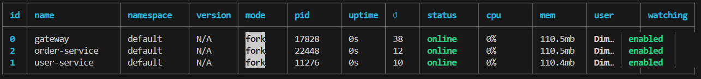

# Microservice asyncronous (RPN Library)
pada materi ini kalian akan di arahkan untuk membuat API library dengan structure microservice di project anda.

Technologi yang akan di pakai adalah: 

1. **Runtime & Package Manager**

- Bun.js - JavaScript/TypeScript runtime dan package manager
- Node.js - Sebagai runtime alternatif
- PM2 - Process Manager untuk menjalankan multiple services

2. **Database & ORM**

- PostgreSQL - Database utama
- Drizzle ORM - ORM untuk PostgreSQL
- Multiple Schema - Satu database dengan multiple schema per service


3. **Framework & Libraries**

- Elysia.js - Web framework untuk Bun.js
- @elysiajs/swagger - Swagger/OpenAPI documentation
- @elysiajs/jwt - JWT authentication
- @elysiajs/cors - CORS handling


4. **Message Queue & Communication**

- CloudAMQP (RabbitMQ) - Message broker untuk komunikasi antar service
- Nodemailer - Untuk mengirim email notifications

5. **Authentication & Security**

- JWT (JSON Web Tokens) - Untuk authentication
- bcrypt - Password hashing


6. **Architecture Pattern**

- Microservices Architecture
- API Gateway Pattern
- Event-Driven Architecture (via RabbitMQ)
- Repository Pattern
- Service Pattern

## Preparing
Sebelum kalian memulai project ini lebih baik menyiapkan tools2 yang akan di pakai terlebih dahulu seperti:
- neonDB
- RabbitMQ / kafka
- smtp mailer

### 1. Neon DB
untuk menyiapkanya neon DB kalian hanya perlu login ke websitenya [Neon.Tech](https://neon.tech) dan mengambil link dbnya saja.

### 2. RabitMQ / kafka
untuk yang satu ini kalian di anjurkan memerlukan docker untuk menjalankannya, jika tidak kalian bisa menggunakan cloud geratis seperti [cloudAMQP](https://www.cloudamqp.com/)

### 3. SMTP mailer
untuk ini kalian bisa menggunakan [sendgrid](https://sendgrid.com/en-us/free), [mailtrap](https://mailtrap.io/blog/free-smtp-servers/) atau [smtpserver](https://smtpserver.com/smtp-server-free)

## Project Architecture
inilah bentuk library sistem ASCII Architecture yang akan kalian buat

```
                        +------------------+
                        |   API Gateway    |
                        | (Routing Layer)  |
                        +------------------+
                                |
        +---------------------+-----------------------+---------------------+
        |                     |                       |                    |
+------------------+ +------------------+  +------------------+  +------------------+
|   User Service   | | Catalog Service  |  | Borrowing Service|  |  Review Service  |
|  (Microservice)  | |  (Microservice)  |  |  (Microservice)  |  |  (Microservice)  |
+------------------+ +------------------+  +------------------+  +------------------+
        |                   |                      |                    |
        +-------------------+----------------------+--------------------+
                                    |
                           +------------------+
                           |   PostgreSQL     |
                           |    Database      |
                           +--------+---------+
                                    |
                    +---------------+----------------+
                    |               |                |
            +--------------+ +--------------+ +--------------+
            | User Schema  | |Catalog Schema| |Borrow Schema |
            |(user_service)| |  (catalog)   | | (borrowing)  |
            +--------------+ +--------------+ +--------------+
                    |               |                |
                    +---------------+----------------+
                                   |
                           +------------------+
                           |    RabbitMQ      |
                           | (Message Broker)  |
                           +------------------+
                                    |
                           +------------------+
                           |  Notification    |
                           |    Service       |
                           +------------------+
                                    |
                           +------------------+
                           |   Email Service  |
                           |    (External)    |
                           +------------------+
```
pada Architecture ini kalian akan membuat microservice dimana setiap service memiliki database yang sama tetapi berbeda schema


## Folder Project
untuk folder project kalian kurang lebih akan seperti ini nantinya

```
digital-library/
├── .env
├── .env.example
├── .gitignore
├── ecosystem.config.js
├── package.json
├── README.md
│
├── scripts/
│   ├── check-services.ts
│   ├── install-dependencies.bat
│   ├── install-dependencies.sh
│   ├── migrate-all.bat
│   ├── migrate-all.sh
│   ├── start-services.bat
│   └── start-services.sh
│
├── services/
│   ├── api-gateway/
│   │   ├── src/
│   │   │   ├── config/
│   │   │   │   ├── services.ts
│   │   │   │   └── config.ts
│   │   │   ├── db/
│   │   │   │   └── migrate.ts
│   │   │   ├── middleware/
│   │   │   │   ├── auth.ts
│   │   │   │   ├── errorHandler.ts
│   │   │   │   ├── jwt.ts
│   │   │   │   └── logger.ts
│   │   │   ├── routes/
│   │   │   │   └── proxies.ts
│   │   │   ├── swagger/
│   │   │   │   └── config.ts
│   │   │   └── index.ts
│   │   ├── .env
│   │   ├── package.json
│   │   └── tsconfig.json
│   │
│   ├── user-service/
│   │   ├── src/
│   │   │   ├── config/
│   │   │   │   ├── database.ts
│   │   │   │   └── config.ts
│   │   │   ├── db/
│   │   │   │   └── migrate.ts
│   │   │   ├── middleware/
│   │   │   │   ├── auth.ts
│   │   │   │   └── errorHandler.ts
│   │   │   ├── models/
│   │   │   │   └── schema.ts
│   │   │   ├── routes/
│   │   │   │   └── userRoutes.ts
│   │   │   ├── services/
│   │   │   │   └── userService.ts
│   │   │   └── index.ts
│   │   ├── .env
│   │   ├── drizzle.config.ts
│   │   ├── package.json
│   │   └── tsconfig.json
│   │
│   ├── catalog-service/
│   │   ├── src/
│   │   │   ├── config/
│   │   │   ├── db/
│   │   │   ├── middleware/
│   │   │   ├── models/
│   │   │   ├── routes/
│   │   │   ├── services/
│   │   │   └── index.ts
│   │   ├── .env
│   │   ├── drizzle.config.ts
│   │   ├── package.json
│   │   └── tsconfig.json
│   │
│   ├── borrowing-service/
│   │   ├── src/
│   │   │   ├── config/
│   │   │   │   └── amqp.ts
│   │   │   ├── db/
│   │   │   ├── middleware/
│   │   │   ├── models/
│   │   │   ├── routes/
│   │   │   ├── services/
│   │   │   └── index.ts
│   │   ├── .env
│   │   ├── drizzle.config.ts
│   │   ├── package.json
│   │   └── tsconfig.json
│   │
│   ├── review-service/
│   │   ├── src/
│   │   │   ├── config/
│   │   │   ├── db/
│   │   │   ├── middleware/
│   │   │   ├── models/
│   │   │   ├── routes/
│   │   │   ├── services/
│   │   │   └── index.ts
│   │   ├── .env
│   │   ├── drizzle.config.ts
│   │   ├── package.json
│   │   └── tsconfig.json
│   │
│   └── notification-service/
│       ├── src/
│       │   ├── config/
│       │   │   └── amqp.ts
│       │   ├── db/
│       │   ├── middleware/
│       │   ├── models/
│       │   ├── routes/
│       │   ├── services/
│       │   │   └── emailService.ts
│       │   ├── templates/
│       │   │   └── emailTemplates.ts
│       │   └── index.ts
│       ├── .env
│       ├── drizzle.config.ts
│       ├── package.json
│       └── tsconfig.json
```

setelah kalian lihat kita akan memiliki 5 service yaitu:
### Penjelasan masing-masing service
1. **User Service**

user service ini di khususkan untuk membuat service khusus untuk user seperti `register`, `login`, `getUserById`, `editUser`. dan untuk userservice ini memiliki schemanya sendiri seperti yang di beritahu sebelumnya

2. **Catalog Service**

catalog service ini di khususkan untuk service yang berhubungan dengan Buku seperti `registerBook`, `findBookById`, `getAllBook`, dan bisa juga berhubungan dengan categories seperti `createCategories`, `getAllCategories`, `editCategories`, getCate`goriesById.

3. **Borowing Service**

Borowing service ini di khususkan untuk membuat service khusus loan seperti `createLoan`, `getAllLoans`, `getUserLoans`, `returnBook`, `checkOverdueLoans`

4. **Review Service**

Review service ini di buat untuk membuat fitur2 review pada buku seperti `createReview`, `getBookReviews`, `getUserReviews`, `updateReview`, `deleteReview`.

5. **Notification Service**

Notification Service ini dibuat khusus untuk mengirimkan notifikasi ke email saat melalukan peminjaman buku atau pengembalian buku

6. **API Gateway**

API gateway ini Dibuat untuk menyatukan semua API service ke dalam satu server agar mudah di jalankan


## Wrtie the Code
Sekarang mari kita program semua service satu-satu

### 1. User Service
pertama masuk ke directory user-service
```
cd service/user-service
```

lalu inisialisasi service dengan menjalankan
```
bun init
```
masukan code ini ke dalam package.json
```json
{
  "name": "user-service",
  "version": "1.0.0",
  "scripts": {
    "dev": "bun run --watch src/index.ts",
    "db:generate": "drizzle-kit generate",
    "db:migrate": "bun run src/db/migrate.ts",
    "db:push": "drizzle-kit push",
    "db:studio": "drizzle-kit studio"
  },
  "dependencies": {
    "@elysiajs/cors": "latest",
    "@elysiajs/jwt": "latest",
    "@elysiajs/swagger": "latest",
    "bcrypt": "^5.1.1",
    "drizzle-orm": "latest",
    "elysia": "latest",
    "postgres": "latest"
  },
  "devDependencies": {
    "bun-types": "latest",
    "drizzle-kit": "latest",
    "dotenv": "^16.4.7"
  }
}
```
lalu install dependencies
```
bun install
```

lalu buat structure project folder untuk service kalian seperti ini
```
user-service/
│   │   ├── src/
│   │   │   ├── config/
│   │   │   │   ├── database.ts
│   │   │   │   └── config.ts
│   │   │   ├── db/
│   │   │   │   └── migrate.ts
│   │   │   ├── middleware/
│   │   │   │   ├── auth.ts
│   │   │   │   └── errorHandler.ts
│   │   │   ├── models/
│   │   │   │   └── schema.ts
│   │   │   ├── routes/
│   │   │   │   └── userRoutes.ts
│   │   │   ├── services/
│   │   │   │   └── userService.ts
│   │   │   └── index.ts
│   │   ├── .env
│   │   ├── drizzle.config.ts
│   │   ├── package.json
│   │   └── tsconfig.json
```

mari mulai dari `drizzle.config.ts` dan `.env`
- drizzle.config.ts
```
// drizzle.config.ts
import type { Config } from 'drizzle-kit'

export default {
  dialect: "postgresql",
  schema: './src/models/*',
  out: './src/migrations',
  dbCredentials: {
    url: process.env.DATABASE_URL!,
  },
  verbose: true,
  strict: true,
  push: {
    mode: "safe" // This prevents dropping tables
  },
  defaultSchemaName: "public"
} satisfies Config
```

- .env
```
DATABASE_URL="url neon db"
JWT_SECRET=randomparanolep
```
jangan lupa masukan databse url neon kalian

lalu ke ke folder config
- src/config/config.ts
``` ts
// src/config/config.ts
export const dbConfig = {
  url: process.env.DATABASE_URL || 'postgres://[your-neon-connection-string]',
  schema: 'user_service'
}
```
- src/config/database.ts
```ts
// src/config/database.ts
import { drizzle } from 'drizzle-orm/postgres-js'
import postgres from 'postgres'

// Konfigurasi untuk Neon
const connectionString = process.env.DATABASE_URL
const sql = postgres(connectionString, {
  ssl: true, // Wajib untuk Neon DB
  max: 10, // Connection pool size
  idle_timeout: 20,
  connect_timeout: 10
})

export const db = drizzle(sql)
```

lalu folder db
- src/db/migrate.ts
```ts
// src/db/migrate.ts
import { drizzle } from 'drizzle-orm/postgres-js'
import { migrate } from 'drizzle-orm/postgres-js/migrator'
import postgres from 'postgres'
import * as dotenv from 'dotenv'
dotenv.config()

const runMigration = async () => {
  const sql = postgres(process.env.DATABASE_URL!, { max: 1 })
  const db = drizzle(sql)

  console.log('Creating schema if not exists...')
  await sql`CREATE SCHEMA IF NOT EXISTS user_service;`

  console.log('Running migrations...')
  await migrate(db, { migrationsFolder: './src/migrations' })

  await sql.end()
  console.log('Migration completed')
}

runMigration().catch(console.error)
```

lalu ke middleware

- src/middleware/errorHandler.ts
```ts
// src/middleware/errorHandler.ts
import { Elysia } from 'elysia'

export const errorHandler = new Elysia()
  .onError(({ code, error, set }: any) => {
    switch (code) {
      case 'NOT_FOUND':
        set.status = 404
        return { error: 'Not Found' }
      case 'VALIDATION':
        set.status = 400
        return { error: 'Validation Error', details: error.message }
      default:
        set.status = 500
        return { error: 'Internal Server Error' }
    }
  })
```

lalu folder models
- src/models/schema.ts
```ts
// src/models/schema.ts
import { pgTable, serial, varchar, timestamp } from 'drizzle-orm/pg-core'

// Define schema name
const schema = 'public'

export const users = pgTable('users', {
  id: serial('id').primaryKey(),
  username: varchar('username', { length: 50 }).notNull(),
  email: varchar('email', { length: 100 }).notNull().unique(),
  password: varchar('password', { length: 255 }).notNull(),
  createdAt: timestamp('created_at').defaultNow(),
  updatedAt: timestamp('updated_at').defaultNow()
}, (table) => {
  return {
    ...table,
    schema: schema
  }
})
```

folder routes
- src/routes/userRoutes.ts
```ts
// src/routes/userRoutes.ts
import { Elysia, t } from 'elysia'
import { UserService } from '../services/userServices'

const userService = new UserService()

export const userRoutes = new Elysia({ prefix: '/api/users' })
  .post('/register', async ({ body }) => {
    return await userService.createUser(body)
  }, {
    body: t.Object({
      username: t.String(),
      email: t.String(),
      password: t.String()
    })
  })
  
  // @ts-ignore
  .post('/login', async ({ body, jwt }) => {
    const user = await userService.loginUser(body.email, body.password)
    const token = await jwt.sign({ id: user.id })
    return { user, token }
  }, {
    body: t.Object({
      email: t.String(),
      password: t.String()
    })
  })
  
  // @ts-ignore
  .get('/:id', async ({ params, jwt }) => {
    return await userService.getUserById(Number(params.id))
  }, {
    params: t.Object({
      id: t.String()
    })
  })
  
  .put('/:id', async ({ params, body }) => {
    return await userService.updateUser(Number(params.id), body)
  }, {
    params: t.Object({
      id: t.String()
    }),
    body: t.Object({
      username: t.Optional(t.String()),
      email: t.Optional(t.String()),
      password: t.Optional(t.String())
    })
  })
```
folder services
- src/services/userService.ts
```ts
// src/services/userService.ts
import { eq } from 'drizzle-orm'
import { db } from '../config/database'
import { users } from '../models/schema'
import { hash, compare } from 'bcrypt'

export class UserService {
  async createUser(userData: any) {
    try {
        const hashedPassword = await hash(userData.password, 10);
        const user = await db.insert(users).values({
            ...userData,
            password: hashedPassword,
        }).returning();
        return user;
    } catch (error) {
        console.error('Error in createUser:', error);
        throw new Error('Failed to create user');
    }
  }

  async loginUser(email: string, password: string) {
    try {
        const user = await db.select().from(users).where(eq(users.email, email)).limit(1);
        if (!user.length) {
            throw new Error('User not found');
        }

        const isValid = await compare(password, user[0].password);
        if (!isValid) {
            throw new Error('Invalid password');
        }

        return user[0];
    } catch (error) {
        console.error('Error in loginUser:', error);
        throw new Error('Failed to login user');
    }
  }

  async getUserById(id: number) {
    try {
        const user = await db.select().from(users).where(eq(users.id, id)).limit(1);
        if (!user.length) {
            throw new Error('User not found');
        }
        return user[0];
    } catch (error) {
        console.error('Error in getUserById:', error);
        throw new Error('Failed to fetch user');
      }
}

  async updateUser(id: number, userData: any) {
    try {
        if (userData.password) {
            userData.password = await hash(userData.password, 10);
        }
        const updatedUser = await db.update(users)
            .set(userData)
            .where(eq(users.id, id))
            .returning();
        return updatedUser;
    } catch (error) {
        console.error('Error in updateUser:', error);
        throw new Error('Failed to update user');
    }
  }

}
```

- src/index.ts
```ts
// src/index.ts
import { Elysia } from 'elysia'
import { swagger } from '@elysiajs/swagger'
import { jwt } from '@elysiajs/jwt'
import { userRoutes } from './routes/userRoutes'
import { errorHandler } from './middleware/errorHandler'
import { cors } from '@elysiajs/cors'

const app = new Elysia()
  .use(swagger({
    path: '/docs',
    documentation: {
      info: {
        title: 'User Service API',
        version: '1.0.0'
      }
    }
  }))
  .use(cors())
  .use(jwt({
    name: 'jwt',
    secret: process.env.JWT_SECRET || 'your-secret-key'
  }))
  .use(errorHandler)
  .use(userRoutes)
  .listen(3001)

console.log(`🦊 User service is running at ${app.server?.hostname}:${app.server?.port}`)
```

jika sudah kalian bisa coba dengan menjalankan terminal berikut
```
bun run db:generate
bun run db:migrate
bun run dev
```

code di atas dijalankan untuk
- `db:generate`: untuk menggenerate schema menggunakan drizzle
- `db:migrate`: memasukan schema database yang kita generate tadi ke dalam
database
- `bun run dev`: menjalankan code di terminal

jika berhasil maka akan muncul log dengan server port 3001, dan jika ingin mencobanya menggunakan
maka masuke ke `localhost:3001/docs`

### 2. Catalog Service

masukan code ini ke dalam package.json
```json
{
  "name": "catalog-service",
  "version": "1.0.0",
  "scripts": {
    "dev": "bun run --watch src/index.ts",
    "db:generate": "drizzle-kit generate",
    "db:migrate": "bun run src/db/migrate.ts",
    "db:push": "drizzle-kit push",
    "db:studio": "drizzle-kit studio"
  },
  "dependencies": {
    "@elysiajs/cors": "latest",
    "@elysiajs/jwt": "latest",
    "@elysiajs/swagger": "latest",
    "bcrypt": "^5.1.1",
    "drizzle-orm": "latest",
    "elysia": "latest",
    "jsonwebtoken": "^9.0.2",
    "postgres": "latest"
  },
  "devDependencies": {
    "bun-types": "latest",
    "drizzle-kit": "latest",
    "dotenv": "^16.4.7"
  }
}
```
lalu install dependencies
```
bun install
```

mari mulai dari `drizzle.config.ts` dan `.env`
- drizzle.config.ts
```
// drizzle.config.ts
import type { Config } from 'drizzle-kit'

export default {
  dialect: "postgresql",
  schema: './src/models/*',
  out: './src/migrations',
  dbCredentials: {
    url: process.env.DATABASE_URL!,
  },
  verbose: true,
  strict: true,
  push: {
    mode: "safe" // This prevents dropping tables
  },
  defaultSchemaName: "public"
} satisfies Config
```

- .env
```
DATABASE_URL="url neon db"
JWT_SECRET=randomparanolep
```
jangan lupa masukan databse url neon kalian

lalu ke ke folder config
- src/config/config.ts
``` ts
// src/config/config.ts
export const dbConfig = {
  url: process.env.DATABASE_URL || 'postgres://[your-neon-connection-string]',
  schema: 'user_service'
}
```
- src/config/database.ts
```ts
// src/config/database.ts
import { drizzle } from 'drizzle-orm/postgres-js'
import postgres from 'postgres'

// Konfigurasi untuk Neon
const connectionString = process.env.DATABASE_URL
const sql = postgres(connectionString, {
  ssl: true, // Wajib untuk Neon DB
  max: 10, // Connection pool size
  idle_timeout: 20,
  connect_timeout: 10
})

export const db = drizzle(sql)
```

lalu folder db
- src/db/migrate.ts
```ts
// src/db/migrate.ts
import { drizzle } from 'drizzle-orm/postgres-js'
import { migrate } from 'drizzle-orm/postgres-js/migrator'
import postgres from 'postgres'
import * as dotenv from 'dotenv'
dotenv.config()

const runMigration = async () => {
  const sql = postgres(process.env.DATABASE_URL!, { max: 1 })
  const db = drizzle(sql)

  console.log('Creating schema if not exists...')
  await sql`CREATE SCHEMA IF NOT EXISTS catalog_service;`

  console.log('Running migrations...')
  await migrate(db, { migrationsFolder: './src/migrations' })

  await sql.end()
  console.log('Migration completed')
}

runMigration().catch(console.error)
```

lalu ke middleware

- src/middleware/errorHandler.ts
```ts
// src/middleware/errorHandler.ts
import { Elysia } from 'elysia'

export const errorHandler = new Elysia()
  .onError(({ code, error, set }: any) => {
    switch (code) {
      case 'NOT_FOUND':
        set.status = 404
        return { error: 'Not Found' }
      case 'VALIDATION':
        set.status = 400
        return { error: 'Validation Error', details: error.message }
      default:
        set.status = 500
        return { error: 'Internal Server Error' }
    }
  })
```

- src/middleware/auth.ts
```ts
// src/middleware/auth.ts
export const authMiddleware = async ({ request, set }: any) => {
  const authHeader = request.headers.get('authorization')
  
  if (!authHeader?.startsWith('Bearer ')) {
    set.status = 401
    return { error: 'Unauthorized - No token provided' }
  }

  try {
    const token = authHeader.split(' ')[1]
    
    // Ensure we're preserving the authorization header
    if (!request.headers.has('authorization')) {
      request.headers.set('authorization', authHeader)
    }
    
    return // Just continue to the next handler
  } catch (error) {
    set.status = 401
    return { error: 'Invalid token' }
  }
}
```

lalu folder models
- src/models/schema.ts
```ts
// src/models/schema.ts
import { pgTable, serial, varchar, text, integer, timestamp } from 'drizzle-orm/pg-core'

// Specify schema name for catalog service
const catalogSchema = 'public'

export const books = pgTable('books', {
  id: serial('id').primaryKey(),
  title: varchar('title', { length: 255 }).notNull(),
  author: varchar('author', { length: 100 }).notNull(),
  isbn: varchar('isbn', { length: 13 }).notNull().unique(),
  description: text('description'),
  categoryId: integer('category_id'),
  totalCopies: integer('total_copies').notNull().default(0),
  availableCopies: integer('available_copies').notNull().default(0),
  createdAt: timestamp('created_at').defaultNow(),
  updatedAt: timestamp('updated_at').defaultNow()
}, (table) => {
  return {
    ...table,
    schema: catalogSchema
  }
})

export const categories = pgTable('categories', {
  id: serial('id').primaryKey(),
  name: varchar('name', { length: 50 }).notNull(),
  description: text('description'),
  createdAt: timestamp('created_at').defaultNow(),
  updatedAt: timestamp('updated_at').defaultNow()
}, (table) => {
  return {
    ...table,
    schema: catalogSchema
  }
})
```

folder routes
- src/routes/bookRoutes.ts
```ts
// src/routes/bookRoutes.ts
import { Elysia, t } from 'elysia'
import { BookService } from '../services/bookService'
import { authMiddleware } from '../middleware/auth'

const bookService = new BookService()

export const bookRoutes = new Elysia({ prefix: '/api/books' })
  .get('/', async ({ query }: any) => {
    const { page = 1, limit = 10, search } = query
    return await bookService.getBooks(Number(page), Number(limit), search)
  }, {
    query: t.Object({
      page: t.Optional(t.String()),
      limit: t.Optional(t.String()),
      search: t.Optional(t.String())
    })
  })

  .get('/:id', async ({ params }: any) => {
    return await bookService.getBookById(Number(params.id))
  }, {
    params: t.Object({
      id: t.String()
    })
  })

  .post('/', async ({ body }: any) => {
    const result = await bookService.createBook(body)
    return result[0] // Return full book object instead of array
  }, {
    beforeHandle: [authMiddleware],
    body: t.Object({
      title: t.String(),
      author: t.String(),
      isbn: t.String(),
      description: t.Optional(t.String()),
      categoryId: t.Optional(t.Number()),
      totalCopies: t.Number(),
      availableCopies: t.Number()
    })
  })

  .put('/:id', async ({ params, body }: any) => {
    return await bookService.updateBook(Number(params.id), body)
  }, {
    beforeHandle: [authMiddleware],
    params: t.Object({
      id: t.String()
    }),
    body: t.Object({
      title: t.Optional(t.String()),
      author: t.Optional(t.String()),
      isbn: t.Optional(t.String()),
      description: t.Optional(t.String()),
      categoryId: t.Optional(t.Number()),
      totalCopies: t.Optional(t.Number()),
      availableCopies: t.Optional(t.Number())
    })
  })

  .delete('/:id', async ({ params }: any) => {
    return await bookService.deleteBook(Number(params.id))
  }, {
    beforeHandle: [authMiddleware],
    params: t.Object({
      id: t.String()
    })
  })
```

- src/routes/categoryRoutes.ts
```ts
// src/routes/categoryRoutes.ts
import { Elysia, t } from 'elysia'
import { CategoryService } from '../services/categoryService'
import { authMiddleware } from '../middleware/auth'

const categoryService = new CategoryService()

export const categoryRoutes = new Elysia({ prefix: '/api/categories' })
  .get('/', async () => {
    return await categoryService.getCategories()
  })

  .get('/:id', async ({ params }: any) => {
    return await categoryService.getCategoryById(Number(params.id))
  }, {
    params: t.Object({
      id: t.String()
    })
  })

  .get('/:id/books', async ({ params }: any) => {
    return await categoryService.getBooksInCategory(Number(params.id))
  }, {
    params: t.Object({
      id: t.String()
    })
  })

  .post('/', async ({ body }: any) => {
    return await categoryService.createCategory(body)
  }, {
    beforeHandle: [authMiddleware],
    body: t.Object({
      name: t.String(),
      description: t.Optional(t.String())
    })
  })

  .put('/:id', async ({ params, body }: any) => {
    return await categoryService.updateCategory(Number(params.id), body)
  }, {
    beforeHandle: [authMiddleware],
    params: t.Object({
      id: t.String()
    }),
    body: t.Object({
      name: t.Optional(t.String()),
      description: t.Optional(t.String())
    })
  })

  .delete('/:id', async ({ params }: any) => {
    return await categoryService.deleteCategory(Number(params.id))
  }, {
    beforeHandle: [authMiddleware],
    params: t.Object({
      id: t.String()
    })
  })
```

folder services
- src/services/bookService.ts
```ts
// src/services/bookService.ts
import { eq, like, sql  } from 'drizzle-orm'
import { db } from '../config/database'
import { books } from '../models/schema'

export class BookService {
  async createBook(bookData: any) {
    try {
        const book = await db.insert(books).values(bookData).returning();
        return book;
    } catch (error) {
        console.error('Error in createBook:', error);
        throw new Error('Failed to create book');
    }
  }

  async getBooks(page: number = 1, limit: number = 10, search?: string) {
    try {
        const offset = (page - 1) * limit;
        let query = db.select().from(books).limit(limit).offset(offset);

        if (search) {
            query = query.where(like(books.title, `%${search}%`));
        }

        const [data, total] = await Promise.all([
            query,
            db.select({ count: sql<number>`count(*)` }).from(books).then(res => Number(res[0].count)),
        ]);

        return {
            data,
            total,
            page,
            totalPages: Math.ceil(total / limit),
        };
    } catch (error) {
        console.error('Error in getBooks:', error);
        throw new Error('Failed to fetch books');
    }
  }

  async getBookById(id: number) {
    try {
        const book = await db.select().from(books).where(eq(books.id, id)).limit(1);
        if (!book.length) throw new Error('Book not found');
        return book[0];
    } catch (error) {
        console.error('Error in getBookById:', error);
        throw new Error('Failed to fetch book');
    }
  }

  async updateBook(id: number, bookData: any) {
    try {
        const updatedBook = await db.update(books)
            .set(bookData)
            .where(eq(books.id, id))
            .returning();
        return updatedBook;
    } catch (error) {
        console.error('Error in updateBook:', error);
        throw new Error('Failed to update book');
    }
  }

  async deleteBook(id: number) {
    try {
        const deletedBook = await db.delete(books)
            .where(eq(books.id, id))
            .returning();
        return deletedBook;
    } catch (error) {
        console.error('Error in deleteBook:', error);
        throw new Error('Failed to delete book');
    }
  }

  async updateBookCopies(id: number, action: 'borrow' | 'return') {
    try {
        const book = await this.getBookById(id);

        if (action === 'borrow' && book.availableCopies < 1) {
            throw new Error('No copies available');
        }

        const availableCopies = action === 'borrow'
            ? book.availableCopies - 1
            : book.availableCopies + 1;

        const updatedBook = await this.updateBook(id, { availableCopies });
        return updatedBook;
    } catch (error) {
        console.error('Error in updateBookCopies:', error);
        throw new Error('Failed to update book copies');
    }
  }

}
```

- src/services/categoryService.ts
```ts
// src/services/categoryService.ts
import { eq } from 'drizzle-orm'
import { db } from '../config/database'
import { categories, books } from '../models/schema'

export class CategoryService {
  async createCategory(data: any) {
    try {
        const category = await db.insert(categories).values(data).returning();
        return category;
    } catch (error) {
        console.error('Error in createCategory:', error);
        throw new Error('Failed to create category');
    }
  }

  async getCategories() {
    try {
        const categoriesList = await db.select().from(categories);
        return categoriesList;
    } catch (error) {
        console.error('Error in getCategories:', error);
        throw new Error('Failed to fetch categories');
    }
  }

  async getCategoryById(id: number) {
    try {
        const category = await db.select()
            .from(categories)
            .where(eq(categories.id, id))
            .limit(1);

        if (!category.length) {
            throw new Error('Category not found');
        }

        return category[0];
    } catch (error) {
        console.error('Error in getCategoryById:', error);
        throw new Error('Failed to fetch category');
    }
  }

  async updateCategory(id: number, data: any) {
    try {
        const updatedCategory = await db.update(categories)
            .set(data)
            .where(eq(categories.id, id))
            .returning();
        return updatedCategory;
    } catch (error) {
        console.error('Error in updateCategory:', error);
        throw new Error('Failed to update category');
    }
  }

  async deleteCategory(id: number) {
    try {
        const deletedCategory = await db.delete(categories)
            .where(eq(categories.id, id))
            .returning();
        return deletedCategory;
    } catch (error) {
        console.error('Error in deleteCategory:', error);
        throw new Error('Failed to delete category');
    }
  }

  async getBooksInCategory(id: number) {
    try {
        const booksList = await db.select()
            .from(books)
            .where(eq(books.categoryId, id));
        return booksList;
    } catch (error) {
        console.error('Error in getBooksInCategory:', error);
        throw new Error('Failed to fetch books in category');
    }
  }
}
```

- src/index.ts
```ts
// src/index.ts
import { Elysia } from 'elysia'
import { swagger } from '@elysiajs/swagger'
import { jwt } from '@elysiajs/jwt'
import { cors } from '@elysiajs/cors'
import { bookRoutes } from './routes/bookRoute'
import { categoryRoutes } from './routes/categoryRoute'
import { errorHandler } from './middleware/errorHandler'

const app = new Elysia()
  .use(swagger({
    path: '/docs',
    documentation: {
      info: {
        title: 'Catalog Service API',
        version: '1.0.0'
      },
      components: {
        securitySchemes: {
          bearerAuth: {
            type: 'http',
            scheme: 'bearer',
            bearerFormat: 'JWT'
          }
        }
      },
      security: [{ bearerAuth: [] }]
    }
  }))
  .use(cors())
  .use(jwt({
    name: 'jwt',
    secret: process.env.JWT_SECRET || 'your-secret-key'
  }))
  .use(errorHandler)
  .use(bookRoutes)
  .use(categoryRoutes)
  .listen(3002)

console.log(`🚀 Catalog service is running at ${app.server?.hostname}:${app.server?.port}`)
```

jika sudah kalian bisa coba dengan menjalankan terminal berikut
```
bun run db:generate
bun run db:migrate
bun run dev
```

jika berhasil maka kana berjalan di port 3002

### 3. Borrowing Service

untuk service ini kita akan menginstall dependencies tambahan dari sebelumnya
```json
{
  "name": "borrowing-service",
  "version": "1.0.0",
  "scripts": {
    "dev": "bun run --watch src/index.ts",
    "db:generate": "drizzle-kit generate",
    "db:migrate": "bun run src/db/migrate.ts",
    "db:push": "drizzle-kit push",
    "db:studio": "drizzle-kit studio"
  },
  "dependencies": {
    "@elysiajs/cors": "latest",
    "@elysiajs/jwt": "latest",
    "@elysiajs/swagger": "latest",
    "amqplib": "^0.10.5",
    "bcrypt": "^5.1.1",
    "drizzle-orm": "latest",
    "elysia": "latest",
    "jsonwebtoken": "^9.0.2",
    "postgres": "latest"
  },
  "devDependencies": {
    "@types/amqplib": "^0.10.6",
    "@types/jsonwebtoken": "^9.0.7",
    "bun-types": "latest",
    "dotenv": "^16.4.7",
    "drizzle-kit": "latest"
  }
}
```
lalu install dependencies
```
bun install
```

seperti sebulumnya mari mulai dari `drizzle.config.ts` dan `.env`
- drizzle.config.ts
```ts 
// drizzle.config.ts
import type { Config } from 'drizzle-kit'

export default {
  dialect: "postgresql",
  schema: './src/models/*',
  out: './src/migrations',
  dbCredentials: {
    url: process.env.DATABASE_URL!,
  },
  verbose: true,
  strict: true,
  push: {
    mode: "safe" // This prevents dropping tables
  },
  defaultSchemaName: "public"
} satisfies Config
```

- .env
```
DATABASE_URL="url neon db"
JWT_SECRET=randomparanolep
CATALOG_SERVICE_URL=http://localhost:3002
CLOUDAMQP_URL="url amqp rmq"
```
jangan lupa masukan databse url neon kalian dan tambahkan port katalog dan amqp

lalu ke ke folder config
- src/config/config.ts
``` ts
// src/config/config.ts
export const dbConfig = {
  url: process.env.DATABASE_URL || 'postgres://[your-neon-connection-string]',
  schema: 'user_service'
}
```
- src/config/database.ts
```ts
// src/config/database.ts
import { drizzle } from 'drizzle-orm/postgres-js'
import postgres from 'postgres'

const connectionString = process.env.DATABASE_URL

const client = postgres(connectionString, { 
  max: 1,
  ssl: true
})

export const db = drizzle(client)
```
- src/config/amqp.ts
```ts
// borrowing-service/src/config/amqp.ts
import amqp from 'amqplib'

let channel: amqp.Channel | null = null

export const getChannel = async () => {
    if (!channel) {
        const connection = await amqp.connect(process.env.CLOUDAMQP_URL!)
        channel = await connection.createChannel()
    }
    return channel
}
```

lalu folder db
- src/db/migrate.ts
```ts
// src/db/migrate.ts
import { drizzle } from 'drizzle-orm/postgres-js'
import { migrate } from 'drizzle-orm/postgres-js/migrator'
import postgres from 'postgres'
import * as dotenv from 'dotenv'
dotenv.config()

const runMigration = async () => {
  const sql = postgres(process.env.DATABASE_URL!, { max: 1 })
  const db = drizzle(sql)

  console.log('Creating schema if not exists...')
  await sql`CREATE SCHEMA IF NOT EXISTS borrowing_service;`

  console.log('Running migrations...')
  await migrate(db, { migrationsFolder: './src/migrations' })

  await sql.end()
  console.log('Migration completed')
}

runMigration().catch(console.error)
```

lalu ke middleware

- src/middleware/errorHandler.ts
```ts
// src/middleware/errorHandler.ts
import { Elysia } from 'elysia'

export const errorHandler = new Elysia()
  .onError(({ code, error, set }: any) => {
    switch (code) {
      case 'NOT_FOUND':
        set.status = 404
        return { error: 'Not Found' }
      case 'VALIDATION':
        set.status = 400
        return { error: 'Validation Error', details: error.message }
      default:
        set.status = 500
        return { error: 'Internal Server Error' }
    }
  })
```

- src/middleware/auth.ts
```ts
// src/middleware/auth.ts
import { verify } from './jwt'

export const authMiddleware = async ({ request, set }: any) => {
  const authHeader = request.headers.get('authorization')
  
  if (!authHeader?.startsWith('Bearer ')) {
    set.status = 401
    return { error: 'Unauthorized - No token provided' }
  }

  try {
    const token = authHeader.split(' ')[1]
    const payload = await verify(token)
    return
  } catch (error) {
    set.status = 401
    return { error: 'Invalid token' }
  }
}
```

- src/middleware/jwt.ts
```ts
// src/middleware/jwt.ts
import { verify as jwtVerify } from 'jsonwebtoken'

const JWT_SECRET = process.env.JWT_SECRET || 'your-secret-key'

export const verify = (token: string): Promise<any> => {
  return new Promise((resolve, reject) => {
    jwtVerify(token, JWT_SECRET, (err, decoded) => {
      if (err) {
        reject(err)
      } else {
        resolve(decoded)
      }
    })
  })
}
```

lalu folder models
- src/models/schema.ts
```ts
// src/models/schema.ts
import { pgTable, serial, integer, timestamp, text, pgEnum } from 'drizzle-orm/pg-core'

// export const loanStatusEnum = pgEnum('loan_status', ['ACTIVE', 'RETURNED', 'OVERDUE'])

export const loans = pgTable('loans', {
  id: serial('id').primaryKey(),
  userId: integer('user_id').notNull(),
  bookId: integer('book_id').notNull(),
  borrowDate: timestamp('borrow_date').defaultNow(),
  dueDate: timestamp('due_date').notNull(),
  returnDate: timestamp('return_date'),
  status: text('status', { enum: ['ACTIVE', 'RETURNED', 'OVERDUE'] }).notNull().default('ACTIVE'),
  createdAt: timestamp('created_at').defaultNow(),
  updatedAt: timestamp('updated_at').defaultNow()
}, (table) => {
  return {
    ...table,
    schema: 'borrowing_service'
  }
})
```

folder routes
- src/routes/loanRoutes.ts
```ts
// src/routes/loanRoutes.ts
import { Elysia, t } from 'elysia'
import { LoanService } from '../services/loanService'
import { authMiddleware } from '../middleware/auth'

const loanService = new LoanService()

export const loanRoutes = new Elysia({ prefix: '/api/loans' })
  .get('/', async ({ query }) => {
    const { page = 1, limit = 10 } = query
    return await loanService.getAllLoans(Number(page), Number(limit),)
  }, {
    beforeHandle: [authMiddleware],
    query: t.Object({
      page: t.Optional(t.String()),
      limit: t.Optional(t.String()),
    })
  })

  .get('/:id', async ({ query, params }) => {
    const { status } = query
    const { id } = params
    return await loanService.getUserLoans(Number(params.id), status)
  }, {
    beforeHandle: [authMiddleware],
    query: t.Object({
      status: t.Optional(t.String())
    })
  })

  .post('/', async ({ body }) => {
    return await loanService.createLoan(body)
  }, {
    beforeHandle: [authMiddleware],
    body: t.Object({
      userId: t.Number(),
      bookId: t.Number()
    })
  })

  .put('/:id/return', async ({ params }) => {
    return await loanService.returnBook(Number(params.id))
  }, {
    beforeHandle: [authMiddleware],
    params: t.Object({
      id: t.String()
    })
  })

  .get('/overdue', async () => {
    return await loanService.checkOverdueLoans()
  }, {
    beforeHandle: [authMiddleware]
  })
```

folder services
- src/services/loanService.ts
```ts
// src/services/loanService.ts
import { eq, sql } from 'drizzle-orm'
import { db } from '../config/database'
import { loans } from '../models/schema'
import { getChannel } from '../config/amqp'

export class LoanService {
  async createLoan(loanData: any) {
    try {
      // Set due date to 14 days from borrow date
      const dueDate = new Date()
      dueDate.setDate(dueDate.getDate() + 14)

      // Check book availability from catalog service
      const bookResponse = await fetch(`${process.env.CATALOG_SERVICE_URL}/api/books/${loanData.bookId}`)
      
      if (!bookResponse.ok) { 
          // Handle non-200 response (e.g., 404 Book not found)
          const errorMessage = await bookResponse.json();
          throw new Error(errorMessage.message || 'Error fetching book data');
      }
      
      const book = await bookResponse.json();

      if (!book || book.availableCopies < 1) {
          throw new Error('Book not available');
      }

      const channel = await getChannel()
        await channel.sendToQueue('loan.due', Buffer.from(JSON.stringify({
            userId: loanData.userId,
            bookId: loanData.bookId,
            dueDate
        })))

      // Create loan
      const loan = await db.insert(loans)
        .values({
          ...loanData,
          dueDate,
          status: 'ACTIVE'
        })
        .returning()

      // Update book availability in catalog service
      await fetch(`${process.env.CATALOG_SERVICE_URL}/api/books/${loanData.bookId}`, {
          method: 'PUT',
          headers: { 'Content-Type': 'application/json' },
          body: JSON.stringify({
            availableCopies: book.availableCopies - 1
          })
      });

      return loan[0];
    } catch (error) {
      console.error('Error in createLoan:', error);
      throw error; // Propagate the error for further handling
    }
  }


  async getAllLoans(page: number = 1, limit: number = 10) {
    try {
        const offset = (page - 1) * limit;
        let query = db.select().from(loans).limit(limit).offset(offset);

        const [data, total] = await Promise.all([
            query,
            db.select({ count: sql<number>`count(*)` }).from(loans).then(res => Number(res[0].count)),
        ]);

        return {
            data,
            total,
            page,
            totalPages: Math.ceil(total / limit),
        };
    } catch (error) {
        console.error('Error in getAllLoans:', error);
        throw new Error('Failed to fetch loans');
    }
  }

  async getUserLoans(userId: number, status?: string) {
    try {
        let query = db.select().from(loans).where(eq(loans.userId, userId));

        if (status) {
            query = query.where(eq(loans.status, status));
        }

        const userLoans = await query;
        return userLoans;
    } catch (error) {
        console.error('Error in getUserLoans:', error);
        throw new Error('Failed to fetch user loans');
    }
  }

  async returnBook(loanId: number) {
    try {
        const loan = await db.select()
            .from(loans)
            .where(eq(loans.id, loanId))
            .limit(1);

        if (!loan.length || loan[0].status !== 'ACTIVE') {
            throw new Error('Invalid loan or already returned');
        }

        // Update loan status
        const updatedLoan = await db.update(loans)
            .set({
                returnDate: new Date(),
                status: 'RETURNED',
                updatedAt: new Date(),
            })
            .where(eq(loans.id, loanId))
            .returning();

        // Update book availability in catalog service
        const bookResponse = await fetch(`${process.env.CATALOG_SERVICE_URL}/api/books/${loan[0].bookId}`);
        if (!bookResponse.ok) {
            throw new Error('Failed to fetch book data from catalog service');
        }

        const book = await bookResponse.json();

        await fetch(`${process.env.CATALOG_SERVICE_URL}/api/books/${loan[0].bookId}`, {
            method: 'PUT',
            headers: { 'Content-Type': 'application/json' },
            body: JSON.stringify({
                availableCopies: book.availableCopies + 1,
            }),
        });

        const channel = await getChannel()
        await channel.sendToQueue('book.returned', Buffer.from(JSON.stringify({
            userId: loan[0].userId,
            bookId: loan[0].bookId
        })))

        return updatedLoan[0];
    } catch (error) {
        console.error('Error in returnBook:', error);
        throw new Error('Failed to return book');
    }
  }

  async checkOverdueLoans() {
    try {
        const now = new Date();
        const overdueLoans = await db.select()
            .from(loans)
            .where(eq(loans.status, 'ACTIVE'))
            .where('due_date', '<', now);

        // Update status to OVERDUE
        for (const loan of overdueLoans) {
            await db.update(loans)
                .set({ status: 'OVERDUE', updatedAt: now })
                .where(eq(loans.id, loan.id));
        }

        return overdueLoans;
    } catch (error) {
        console.error('Error in checkOverdueLoans:', error);
        throw new Error('Failed to check overdue loans');
    }
  }

}
```

- src/index.ts
```ts
// src/index.ts
import { Elysia } from 'elysia'
import { swagger } from '@elysiajs/swagger'
import { jwt } from '@elysiajs/jwt'
import { cors } from '@elysiajs/cors'
import { loanRoutes } from './routes/loanRoutes'
import { errorHandler } from './middleware/errorHandler'

const app = new Elysia()
  .use(swagger({
    path: '/docs',
    documentation: {
      info: {
        title: 'Borrowing Service API',
        version: '1.0.0'
      },
      components: {
        securitySchemes: {
          bearerAuth: {
            type: 'http',
            scheme: 'bearer',
            bearerFormat: 'JWT'
          }
        }
      },
      security: [{ bearerAuth: [] }]
    }
  }))
  .use(cors())
  .use(jwt({
    name: 'jwt',
    secret: process.env.JWT_SECRET || 'your-secret-key'
  }))
  .use(errorHandler)
  .use(loanRoutes)
  .listen(3003)

console.log(`🦊 User service is running at ${app.server?.hostname}:${app.server?.port}`)
```

jika sudah kalian bisa coba dengan menjalankan terminal berikut
```
bun run db:generate
bun run db:migrate
bun run dev
```

jika berhasil maka kana berjalan di port 3003

### 4. Review Service

untuk service ini kita akan menginstall dependencies tambahan dari sebelumnya
```json
{
  "name": "borrowing-service",
  "version": "1.0.0",
  "scripts": {
    "dev": "bun run --watch src/index.ts",
    "db:generate": "drizzle-kit generate",
    "db:migrate": "bun run src/db/migrate.ts",
    "db:push": "drizzle-kit push",
    "db:studio": "drizzle-kit studio"
  },
  "dependencies": {
    "@elysiajs/cors": "latest",
    "@elysiajs/jwt": "latest",
    "@elysiajs/swagger": "latest",
    "bcrypt": "^5.1.1",
    "drizzle-orm": "latest",
    "elysia": "latest",
    "jsonwebtoken": "^9.0.2",
    "postgres": "latest"
  },
  "devDependencies": {
    "@types/jsonwebtoken": "^9.0.7",
    "bun-types": "latest",
    "dotenv": "^16.4.7",
    "drizzle-kit": "latest"
  }
}
```
lalu install dependencies
```
bun install
```

seperti sebulumnya mari mulai dari `drizzle.config.ts` dan `.env`
- drizzle.config.ts
```ts 
// drizzle.config.ts
import type { Config } from 'drizzle-kit'

export default {
  dialect: "postgresql",
  schema: './src/models/*',
  out: './src/migrations',
  dbCredentials: {
    url: process.env.DATABASE_URL!,
  },
  verbose: true,
  strict: true,
  push: {
    mode: "safe" // This prevents dropping tables
  },
  defaultSchemaName: "public"
} satisfies Config
```

- .env
```
DATABASE_URL="url neon db"
JWT_SECRET=randomparanolep
CATALOG_SERVICE_URL=http://localhost:3002
```
jangan lupa masukan databse url neon kalian dan tambahkan port katalog dan amqp

lalu ke ke folder config

- src/config/database.ts
```ts
// src/config/database.ts
import { drizzle } from 'drizzle-orm/postgres-js'
import postgres from 'postgres'

const connectionString = process.env.DATABASE_URL

const client = postgres(connectionString, { 
  max: 1,
  ssl: true
})

export const db = drizzle(client)
```

lalu folder db
- src/db/migrate.ts
```ts
// src/db/migrate.ts
import { drizzle } from 'drizzle-orm/postgres-js'
import { migrate } from 'drizzle-orm/postgres-js/migrator'
import postgres from 'postgres'
import * as dotenv from 'dotenv'
dotenv.config()

const runMigration = async () => {
  const sql = postgres(process.env.DATABASE_URL!, { max: 1 })
  const db = drizzle(sql)

  console.log('Creating schema if not exists...')
  await sql`CREATE SCHEMA IF NOT EXISTS review_service;`

  console.log('Running migrations...')
  await migrate(db, { migrationsFolder: './src/migrations' })

  await sql.end()
  console.log('Migration completed')
}

runMigration().catch(console.error)
```

lalu ke middleware

- src/middleware/errorHandler.ts
```ts
// src/middleware/errorHandler.ts
import { Elysia } from 'elysia'

export const errorHandler = new Elysia()
  .onError(({ code, error, set }: any) => {
    switch (code) {
      case 'NOT_FOUND':
        set.status = 404
        return { error: 'Not Found' }
      case 'VALIDATION':
        set.status = 400
        return { error: 'Validation Error', details: error.message }
      default:
        set.status = 500
        return { error: 'Internal Server Error' }
    }
  })
```

- src/middleware/auth.ts
```ts
// src/middleware/auth.ts
import { verify } from './jwt'

export const authMiddleware = async ({ request, set }: any) => {
  const authHeader = request.headers.get('authorization')
  
  if (!authHeader?.startsWith('Bearer ')) {
    set.status = 401
    return { error: 'Unauthorized - No token provided' }
  }

  try {
    const token = authHeader.split(' ')[1]
    const payload = await verify(token)
    return
  } catch (error) {
    set.status = 401
    return { error: 'Invalid token' }
  }
}
```

- src/middleware/jwt.ts
```ts
// src/middleware/jwt.ts
import { verify as jwtVerify } from 'jsonwebtoken'

const JWT_SECRET = process.env.JWT_SECRET || 'your-secret-key'

export const verify = (token: string): Promise<any> => {
  return new Promise((resolve, reject) => {
    jwtVerify(token, JWT_SECRET, (err, decoded) => {
      if (err) {
        reject(err)
      } else {
        resolve(decoded)
      }
    })
  })
}
```

lalu folder models
- src/models/schema.ts
```ts
// src/models/schema.ts
import { pgTable, serial, integer, text, timestamp } from 'drizzle-orm/pg-core'

export const reviews = pgTable('reviews', {
  id: serial('id').primaryKey(),
  userId: integer('user_id').notNull(),
  bookId: integer('book_id').notNull(),
  rating: integer('rating').notNull(),
  comment: text('comment'),
  createdAt: timestamp('created_at').defaultNow(),
  updatedAt: timestamp('updated_at').defaultNow()
}, (table) => {
  return {
    ...table,
    schema: 'review_service'
  }
})
```

folder routes
- src/routes/loanRoutes.ts
```ts
// src/routes/reviewRoutes.ts
import { Elysia, t } from 'elysia'
import { ReviewService } from '../services/reviewService'
import { authMiddleware } from '../middleware/auth'

const reviewService = new ReviewService()

export const reviewRoutes = new Elysia({ prefix: '/api/reviews' })
  .post('/', async ({ body }) => {
    return await reviewService.createReview(body)
  }, {
    beforeHandle: [authMiddleware],
    body: t.Object({
      userId: t.Number(),
      bookId: t.Number(),
      rating: t.Number(),
      comment: t.Optional(t.String())
    })
  })

  .get('/book/:bookId', async ({ params, query }) => {
    const { page = 1, limit = 10 } = query
    return await reviewService.getBookReviews(Number(params.bookId), Number(page), Number(limit))
  }, {
    params: t.Object({
      bookId: t.String()
    }),
    query: t.Object({
      page: t.Optional(t.String()),
      limit: t.Optional(t.String())
    })
  })

  .get('/user/:userId', async ({ params }) => {
    return await reviewService.getUserReviews(Number(params.userId))
  }, {
    beforeHandle: [authMiddleware],
    params: t.Object({
      userId: t.String()
    })
  })

  .put('/:id', async ({ params, body }) => {
    const { userId, ...updateData } = body
    return await reviewService.updateReview(Number(params.id), userId, updateData)
  }, {
    beforeHandle: [authMiddleware],
    params: t.Object({
      id: t.String()
    }),
    body: t.Object({
      userId: t.Number(),
      rating: t.Optional(t.Number()),
      comment: t.Optional(t.String())
    })
  })

  .delete('/:id', async ({ params, body }) => {
    return await reviewService.deleteReview(Number(params.id), body.userId)
  }, {
    beforeHandle: [authMiddleware],
    params: t.Object({
      id: t.String()
    }),
    body: t.Object({
      userId: t.Number()
    })
  })
```

folder services
- src/services/loanService.ts
```ts
// src/services/reviewService.ts
import { eq, sql } from 'drizzle-orm'
import { db } from '../config/database'
import { reviews } from '../models/schema'

export class ReviewService {
  async createReview(reviewData: any) {
    // Check if user already reviewed this book
    try {
      const existingReview = await db.select()
        .from(reviews)
        .where(eq(reviews.userId, reviewData.userId))
        .where(eq(reviews.bookId, reviewData.bookId))
        .limit(1);
      
      // Check book availability from catalog service
      const bookResponse = await fetch(`${process.env.CATALOG_SERVICE_URL}/api/books/${reviewData.bookId}`)
      
      if (!bookResponse.ok) { 
        // Handle non-200 response (e.g., 404 Book not found)
        const errorMessage = await bookResponse.json();
        throw new Error(errorMessage.message || 'Error fetching book data');
      }
    
      if (existingReview.length) {
        throw new Error('User already reviewed this book');
      }
    
      if (reviewData.rating < 1 || reviewData.rating > 5) {
        throw new Error('Rating must be between 1 and 5');
      }
    
      const review = await db.insert(reviews)
        .values(reviewData)
        .returning();
    
      await this.updateBookAverageRating(reviewData.bookId);
    
      return review[0];
    } catch (error: any) {
      console.error(error);
      throw new Error('Error creating review: ' + error.message);
    }
  }

  async getBookReviews(bookId: number, page: number = 1, limit: number = 10) {
    try {
      const offset = (page - 1) * limit;
  
      const [data, total] = await Promise.all([
        db.select()
          .from(reviews)
          .where(eq(reviews.bookId, bookId))
          .limit(limit)
          .offset(offset)
          .orderBy(reviews.createdAt),
        db.select({ count: sql<number>`count(*)` })
          .from(reviews)
          .where(eq(reviews.bookId, bookId))
          .then(res => Number(res[0].count))
      ]);
  
      return {
        data,
        total,
        page,
        totalPages: Math.ceil(total / limit)
      };
    } catch (error: any) {
      console.error(error);
      throw new Error('Error fetching book reviews: ' + error.message);
    }
  }

  async getUserReviews(userId: number) {
    try {
      return await db.select()
        .from(reviews)
        .where(eq(reviews.userId, userId));
    } catch (error: any) {
      console.error(error);
      throw new Error('Error fetching user reviews: ' + error.message);
    }
  }

  async updateReview(id: number, userId: number, data: any) {
    try {
      const review = await db.select()
        .from(reviews)
        .where(eq(reviews.id, id))
        .limit(1);
  
      if (!review.length || review[0].userId !== userId) {
        throw new Error('Review not found or unauthorized');
      }
  
      if (data.rating && (data.rating < 1 || data.rating > 5)) {
        throw new Error('Rating must be between 1 and 5');
      }
  
      const updatedReview = await db.update(reviews)
        .set({
          ...data,
          updatedAt: new Date()
        })
        .where(eq(reviews.id, id))
        .returning();
  
      if (data.rating) {
        await this.updateBookAverageRating(review[0].bookId);
      }
  
      return updatedReview[0];
    } catch (error: any) {
      console.error(error);
      throw new Error('Error updating review: ' + error.message);
    }
  }

  async deleteReview(id: number, userId: number) {
    try {
      const review = await db.select()
        .from(reviews)
        .where(eq(reviews.id, id))
        .limit(1);
  
      if (!review.length || review[0].userId !== userId) {
        throw new Error('Review not found or unauthorized');
      }
  
      await db.delete(reviews)
        .where(eq(reviews.id, id));
  
      await this.updateBookAverageRating(review[0].bookId);
  
      return { message: 'Review deleted successfully' };
    } catch (error: any) {
      console.error(error);
      throw new Error('Error deleting review: ' + error.message);
    }
  }

  private async updateBookAverageRating(bookId: number) {
    try {
      const result = await db.select({
        averageRating: sql<number>`AVG(rating)::numeric(2,1)`,
        totalReviews: sql<number>`COUNT(*)`
      })
      .from(reviews)
      .where(eq(reviews.bookId, bookId));
  
      await fetch(`${process.env.CATALOG_SERVICE_URL}/api/books/${bookId}`, {
        method: 'PUT',
        headers: { 'Content-Type': 'application/json' },
        body: JSON.stringify({
          averageRating: result[0].averageRating,
          totalReviews: result[0].totalReviews
        })
      });
    } catch (error: any) {
      console.error(error);
      throw new Error('Error updating book average rating: ' + error.message);
    }
  }
}
```

- src/index.ts
```ts
// src/index.ts
import { Elysia } from 'elysia'
import { swagger } from '@elysiajs/swagger'
import { jwt } from '@elysiajs/jwt'
import { cors } from '@elysiajs/cors'
import { reviewRoutes } from './routes/reviewRoutes'
import { errorHandler } from './middleware/errorHandler'

const app = new Elysia()
  .use(swagger({
    path: '/docs',
    documentation: {
      
      info: {
        title: 'Review Service API',
        version: '1.0.0'
      },
      components: {
        securitySchemes: {
          bearerAuth: {
            type: 'http',
            scheme: 'bearer',
            bearerFormat: 'JWT'
          }
        }
      },
      security: [{ bearerAuth: [] }]
    }
  }))
  .use(cors())
  .use(jwt({
    name: 'jwt',
    secret: process.env.JWT_SECRET || 'your-secret-key'
  }))
  .use(errorHandler)
  .use(reviewRoutes)
  .listen(3004)

console.log(`🚀 Review service is running at ${app.server?.hostname}:${app.server?.port}`)
```

jika sudah kalian bisa coba dengan menjalankan terminal berikut
```
bun run db:generate
bun run db:migrate
bun run dev
```

jika berhasil maka kana berjalan di port 3004

### 5. Notification Service

kali ini akan sedikit berbeda dari service2 sebelumnya, dimana kalian akan mengimplementasikan
smtp mailer dan RabitMQ secara bersamaan pada service ini, mari kita mulai

- src/config/amqp.ts
```ts
// src/config/amqp.ts
import amqp from 'amqplib'

export const connectQueue = async () => {
    try {
        const connection = await amqp.connect(process.env.CLOUDAMQP_URL!)
        const channel = await connection.createChannel()
        
        // Declare queues
        await channel.assertQueue('loan.due')
        await channel.assertQueue('book.returned')

        console.log('Connected to CloudAMQP')
        
        return channel
    } catch (error) {
        console.error('Error connecting to CloudAMQP:', error)
        throw error
    }
}
```
- src/config/database.ts
```ts
// src/config/database.ts
import { drizzle } from 'drizzle-orm/postgres-js'
import postgres from 'postgres'

// Konfigurasi untuk Neon
const connectionString = process.env.DATABASE_URL
const sql = postgres(connectionString, {
  ssl: true, // Wajib untuk Neon DB
  max: 10, // Connection pool size
  idle_timeout: 20,
  connect_timeout: 10
})

export const db = drizzle(sql)
```
lalu folder db

- src/config/database.ts
```ts
// src/config/database.ts
import { drizzle } from 'drizzle-orm/postgres-js'
import postgres from 'postgres'

// Konfigurasi untuk Neon
const connectionString = process.env.DATABASE_URL
const sql = postgres(connectionString, {
  ssl: true, // Wajib untuk Neon DB
  max: 10, // Connection pool size
  idle_timeout: 20,
  connect_timeout: 10
})

export const db = drizzle(sql)
```

lalu untuk middleware

- src/middleware/errorHandler.ts
```ts
// src/middleware/errorHandler.ts
import { Elysia } from 'elysia'

export const errorHandler = new Elysia()
  .onError(({ code, error, set }: any) => {
    switch (code) {
      case 'NOT_FOUND':
        set.status = 404
        return { error: 'Not Found' }
      case 'VALIDATION':
        set.status = 400
        return { error: 'Validation Error', details: error.message }
      default:
        set.status = 500
        return { error: 'Internal Server Error' }
    }
  })
```

- src/middleware/auth.ts
```ts
// src/middleware/auth.ts
import { verify } from './jwt'

export const authMiddleware = async ({ request, set }: any) => {
  const authHeader = request.headers.get('authorization')
  
  if (!authHeader?.startsWith('Bearer ')) {
    set.status = 401
    return { error: 'Unauthorized - No token provided' }
  }

  try {
    const token = authHeader.split(' ')[1]
    const payload = await verify(token)
    return
  } catch (error) {
    set.status = 401
    return { error: 'Invalid token' }
  }
}
```

- src/middleware/jwt.ts
```ts
// src/middleware/jwt.ts
import { verify as jwtVerify } from 'jsonwebtoken'

const JWT_SECRET = process.env.JWT_SECRET || 'your-secret-key'

export const verify = (token: string): Promise<any> => {
  return new Promise((resolve, reject) => {
    jwtVerify(token, JWT_SECRET, (err, decoded) => {
      if (err) {
        reject(err)
      } else {
        resolve(decoded)
      }
    })
  })
}
```

- src/models/schema.ts
```ts
// src/models/schema.ts
import { pgTable, serial, integer, text, timestamp, varchar } from 'drizzle-orm/pg-core'

export const notifications = pgTable('notifications', {
  id: serial('id').primaryKey(),
  userId: integer('user_id').notNull(),
  type: varchar('type', { length: 50 }).notNull(), // 'LOAN_DUE', 'BOOK_RETURNED', etc.
  message: text('message').notNull(),
  status: varchar('status', { length: 20 }).notNull().default('PENDING'), // 'PENDING', 'SENT', 'FAILED'
  createdAt: timestamp('created_at').defaultNow(),
  updatedAt: timestamp('updated_at').defaultNow()
}, (table) => {
  return {
    ...table,
    schema: 'notification_service'
  }
})
```


- src/queue/consumers.ts
```ts
// src/queue/consumers.ts
import { connectQueue } from '../config/amqp'
import { NotificationService } from '../services/notificationService'

const notificationService = new NotificationService()

export const setupConsumers = async () => {
    try {
        const channel = await connectQueue()

        // Loan due consumer
        channel.consume('loan.due', async (msg) => {
            if (msg) {
                try {
                    const { userId, bookId, dueDate } = JSON.parse(msg.content.toString())
                    await notificationService.handleLoanDueNotification(userId, bookId, dueDate)
                    channel.ack(msg)
                } catch (error) {
                    console.error('Error processing loan.due:', error)
                    channel.nack(msg)
                }
            }
        })

        // Book returned consumer
        channel.consume('book.returned', async (msg) => {
            if (msg) {
                try {
                    const { userId, bookId } = JSON.parse(msg.content.toString())
                    await notificationService.handleBookReturnedNotification(userId, bookId)
                    channel.ack(msg)
                } catch (error) {
                    console.error('Error processing book.returned:', error)
                    channel.nack(msg)
                }
            }
        })

        console.log('RabbitMQ consumers setup completed')
    } catch (error) {
        console.error('Error setting up RabbitMQ consumers:', error)
    }
}
```

- src/routes/notificationRoutes.ts
```ts
// src/routes/notificationRoutes.ts
import { Elysia, t } from 'elysia'
import { NotificationService } from '../services/notificationService'
import { authMiddleware } from '../middleware/auth'

const notificationService = new NotificationService()

export const notificationRoutes = new Elysia({ prefix: '/api/notifications' })
  .get('/user/:userId', async ({ params, query }: any) => {
    const { page = 1, limit = 10 } = query
    return await notificationService.getUserNotifications(
      Number(params.userId),
      Number(page),
      Number(limit)
    )
  }, {
    beforeHandle: [authMiddleware],
    params: t.Object({
      userId: t.String()
    }),
    query: t.Object({
      page: t.Optional(t.String()),
      limit: t.Optional(t.String())
    })
  })
  .post('/test', async ({ body }: any) => {
    return await notificationService.sendTestNotification(body)
  }, {
    body: t.Object({
      email: t.String(),
      type: t.String({
        enum: ['TEST_EMAIL', 'LOAN_DUE', 'BOOK_RETURNED']
      })
    })
  })
```

- src/services/emailService.ts
```ts
// src/services/emailService.ts
import nodemailer from 'nodemailer'

const transporter = nodemailer.createTransport({
  host: process.env.SMTP_HOST,
  port: Number(process.env.SMTP_PORT),
  secure: true,
  auth: {
    user: process.env.SMTP_USER,
    pass: process.env.SMTP_PASS
  }
})

export const sendEmail = async (to: string, subject: string, html: string) => {
  try {
    const info = await transporter.sendMail({
      from: process.env.SMTP_FROM,
      to,
      subject,
      html
    })
    return info
  } catch (error) {
    console.error('Email sending failed:', error)
    throw error
  }
}
```


- src/services/notificationService.ts
```ts
// src/services/notificationService.ts
import { eq, sql } from 'drizzle-orm'
import { db } from '../config/database'
import { notifications } from '../models/schema'
import { sendEmail } from './emailServices'
import { emailTemplates } from '../templates/emailTemplates'

export class NotificationService {
  async createNotification(data: any) {
    const notification = await db.insert(notifications)
      .values(data)
      .returning()

    // Get user email from user service
    const userResponse = await fetch(`${process.env.USER_SERVICE_URL}/api/users/${data.userId}`)
    const user = await userResponse.json()

    // Send email
    try {
      await sendEmail(
        user.email,
        `Library Notification - ${data.type}`,
        data.message
      )

      await db.update(notifications)
        .set({ status: 'SENT' })
        .where(eq(notifications.id, notification[0].id))
    } catch (error) {
      await db.update(notifications)
        .set({ status: 'FAILED' })
        .where(eq(notifications.id, notification[0].id))
      throw error
    }

    return notification[0]
  }

  async getUserNotifications(userId: number, page: number = 1, limit: number = 10) {
    const offset = (page - 1) * limit

    const [data, total] = await Promise.all([
      db.select()
        .from(notifications)
        .where(eq(notifications.userId, userId))
        .limit(limit)
        .offset(offset)
        .orderBy(notifications.createdAt),
      db.select({ count: sql<number>`count(*)` })
        .from(notifications)
        .where(eq(notifications.userId, userId))
        .then(res => Number(res[0].count))
    ])

    return {
      data,
      total,
      page,
      totalPages: Math.ceil(total / limit)
    }
  }

  async handleLoanDueNotification(userId: number, bookId: number, dueDate: string) {
    const bookResponse = await fetch(`${process.env.CATALOG_SERVICE_URL}/api/books/${bookId}`)
    const book = await bookResponse.json()
  
    const message = emailTemplates.loanDue(book.title, dueDate)
  
    return await this.createNotification({
      userId,
      type: 'LOAN_DUE',
      message
    })
  }
  
  async handleBookReturnedNotification(userId: number, bookId: number) {
    const bookResponse = await fetch(`${process.env.CATALOG_SERVICE_URL}/api/books/${bookId}`)
    const book = await bookResponse.json()
  
    const message = emailTemplates.bookReturned(book.title)
  
    return await this.createNotification({
      userId,
      type: 'BOOK_RETURNED',
      message
    })
  }

  async sendTestNotification(data: { email: string, type: string }) {
    let subject: string
    let message: string

    switch (data.type) {
      case 'TEST_EMAIL':
        subject = 'Test Notification'
        message = emailTemplates.test()
        break
      case 'LOAN_DUE':
        subject = 'Book Due Reminder - Test'
        message = emailTemplates.loanDue('Test Book', new Date().toISOString())
        break
      case 'BOOK_RETURNED':
        subject = 'Book Returned - Test'
        message = emailTemplates.bookReturned('Test Book')
        break
      default:
        throw new Error('Invalid notification type')
    }

    try {
      const result = await sendEmail(data.email, subject, message)
      return {
        success: true,
        message: 'Test notification sent successfully',
        details: result
      }
    } catch (error: any) {
      console.error('Failed to send test notification:', error)
      throw new Error(`Failed to send test notification: ${error.message}`)
    }
  }
}
```

- notification-service/src/templates/emailTemplates.ts
```ts
// notification-service/src/templates/emailTemplates.ts
export const emailTemplates = {
  loanDue: (bookTitle: string, dueDate: string) => `
    <div style="font-family: Arial, sans-serif; padding: 20px; color: #333;">
      <h2>Book Due Reminder</h2>
      <p>Your book "<strong>${bookTitle}</strong>" is due on ${new Date(dueDate).toLocaleDateString()}.</p>
      <p>Please return it to avoid any late fees.</p>
      <br>
      <p>Thank you for using our library service!</p>
    </div>
  `,

  bookReturned: (bookTitle: string) => `
    <div style="font-family: Arial, sans-serif; padding: 20px; color: #333;">
      <h2>Book Returned Successfully</h2>
      <p>Thank you for returning "<strong>${bookTitle}</strong>".</p>
      <p>We hope you enjoyed reading it!</p>
      <br>
      <p>Feel free to browse our catalog for more books.</p>
    </div>
  `,

  newBooksAvailable: (books: Array<{ title: string, author: string }>) => `
    <div style="font-family: Arial, sans-serif; padding: 20px; color: #333;">
      <h2>New Books Available!</h2>
      <p>Check out our latest additions:</p>
      <ul>
        ${books.map(book => `
          <li><strong>${book.title}</strong> by ${book.author}</li>
        `).join('')}
      </ul>
      <br>
      <p>Visit our library to borrow these books today!</p>
    </div>
  `,

  test: () => `
    <div style="font-family: Arial, sans-serif; padding: 20px; color: #333;">
      <h2>Test Notification</h2>
      <p>This is a test notification from the Digital Library system.</p>
      <p>If you received this email, the notification system is working correctly!</p>
      <br>
      <p>Time sent: ${new Date().toLocaleString()}</p>
    </div>
  `
}
```

- src/index.ts
```ts
// src/index.ts
import { Elysia } from 'elysia'
import { swagger } from '@elysiajs/swagger'
import { jwt } from '@elysiajs/jwt'
import { cors } from '@elysiajs/cors'
import { notificationRoutes } from './routes/norificationRoutes'
import { errorHandler } from './middleware/errorHandler'
import { setupConsumers } from './queue/consumers'

const app = new Elysia()
  .use(swagger({
    path: '/docs',
    documentation: {
      info: {
        title: 'Notification Service API',
        version: '1.0.0'
      },
      components: {
        securitySchemes: {
          bearerAuth: {
            type: 'http',
            scheme: 'bearer',
            bearerFormat: 'JWT'
          }
        }
      },
      security: [{ bearerAuth: [] }]
    }
  }))
  .use(cors())
  .use(jwt({
    name: 'jwt',
    secret: process.env.JWT_SECRET || 'your-secret-key'
  }))
  .use(errorHandler)
  .use(notificationRoutes)
  .listen(3005)

// Setup RabbitMQ consumers
setupConsumers()

console.log(`🚀 Notification service is running at ${app.server?.hostname}:${app.server?.port}`)
```

jika sudah kalian bisa coba dengan menjalankan terminal berikut
```
bun run db:generate
bun run db:migrate
bun run dev
```

### 6. API Gateway
bagian ini kalian akan membuat bagian  api gateway server yang mengumpulkan semua service kedalam
satu host server agar lebih mudah di gunakan

- package.json
```json
{
  "name": "api-gateway",
  "version": "1.0.0",
  "scripts": {
    "dev": "bun run --watch src/index.ts"
  },
  "dependencies": {
    "@elysiajs/cors": "latest",
    "@elysiajs/swagger": "latest",
    "elysia": "latest",
    "jsonwebtoken": "latest"
  },
  "devDependencies": {
    "bun-types": "latest",
    "@types/jsonwebtoken": "latest"
  }
}
```

- .env
```
JWT_SECRET=randomparanolep
USER_SERVICE_URL=http://localhost:3001
CATALOG_SERVICE_URL=http://localhost:3002
BORROWING_SERVICE_URL=http://localhost:3003
REVIEW_SERVICE_URL=http://localhost:3004
```

- src/config/services.ts
```ts
// src/config/services.ts
export const services = {
  users: {
    url: process.env.USER_SERVICE_URL || 'http://localhost:3001',
    endpoints: {
      register: '/api/users/register',
      login: '/api/users/login',
      profile: '/api/users/:id'
    }
  },
  catalog: {
    url: process.env.CATALOG_SERVICE_URL || 'http://localhost:3002',
    endpoints: {
      books: '/api/books',
      categories: '/api/categories'
    }
  },
  borrowing: {
    url: process.env.BORROWING_SERVICE_URL || 'http://localhost:3003',
    endpoints: {
      loans: '/api/loans',
      returns: '/api/returns'
    }
  },
  reviews: {
    url: process.env.REVIEW_SERVICE_URL || 'http://localhost:3004',
    endpoints: {
      reviews: '/api/reviews'
    }
  },
  notification: {
    url: process.env.REVIEW_SERVICE_URL || 'http://localhost:3005',
    endpoints: {
      notification: '/api/notification'
    }
  }
}
```

sekarang ke midleware

- src/middleware/auth.ts

```ts
import { verify } from "./jwt"
// src/middleware/auth.ts

export const authMiddleware = async ({ request, set }: any) => {
  const authHeader = request.headers.get('authorization')
  console.log('Auth header:', authHeader) // Debug log

  if (!authHeader?.startsWith('Bearer ')) {
    set.status = 401
    return { error: 'Unauthorized - No token provided' }
  }

  try {
    const token = authHeader.split(' ')[1]
    console.log('Token to verify:', token) // Debug log

    const payload = await verify(token)
    console.log('Token payload:', payload) // Debug log

    // Ensure token is properly set for downstream requests
    if (!request.headers.has('authorization')) {
      request.headers.set('authorization', authHeader)
    }

    return
  } catch (error) {
    console.error('Auth error:', error)
    set.status = 401
    return { error: 'Invalid token' }
  }
}
```

- src/middleware/errorHandler.ts

```ts
// src/middleware/errorHandler.ts
import { Elysia } from 'elysia'

export const errorHandler = new Elysia()
  .onError(({ code, error, set }: any) => {
    console.error(`Error: ${error.message}`)
    
    switch (code) {
      case 'NOT_FOUND':
        set.status = 404
        return { error: 'Not Found' }
      case 'VALIDATION':
        set.status = 400
        return { error: 'Validation Error', details: error.message }
      default:
        set.status = 500
        return { 
          error: 'Internal Server Error',
          message: error.message 
        }
    }
  })
```

- src/middleware/jwt.ts

```ts
// src/middleware/jwt.ts
import { verify as jwtVerify } from 'jsonwebtoken'

const JWT_SECRET = process.env.JWT_SECRET || 'your-secret-key'

interface JWTPayload {
  id: string
  [key: string]: any
}

export const verify = (token: string): Promise<JWTPayload> => {
  return new Promise((resolve, reject) => {
    jwtVerify(token, JWT_SECRET, (err, decoded) => {
      if (err) {
        reject(err)
      } else {
        resolve(decoded as JWTPayload)
      }
    })
  })
}
```

- src/middleware/logger.ts

```ts
// src/middleware/logger.ts
import { Elysia } from 'elysia';

export const logger = new Elysia()
    .onRequest(({ request }) => {
        console.log(`${new Date().toISOString()} [Request] ${request.method} ${request.url}`);
    })
    .on('afterHandle', ({ request, response }) => {
        console.log(
            `${new Date().toISOString()} [Response] ${request.method} ${request.url} - Status: ${response?.status}`
        );
    });

```

- src/middleware/rateLimit.ts

```ts
// src/middleware/rateLimit.ts
import { Elysia } from 'elysia'

const rateLimits = new Map()

export const rateLimit = new Elysia().onRequest(({ request, set }: any) => {
  const ip = request.headers.get('x-forwarded-for') || 'unknown'
  const now = Date.now()
  const windowMs = 60000 // 1 minute
  const limit = 100 // requests per windowMs

  const requests = rateLimits.get(ip) || []
  const windowStart = now - windowMs

  // Clean old requests
  while (requests.length && requests[0] <= windowStart) {
    requests.shift()
  }

  if (requests.length >= limit) {
    set.status = 429
    return { error: 'Too many requests' }
  }

  requests.push(now)
  rateLimits.set(ip, requests)
})
```

- src/routes/proxies.ts

```ts
// src/routes/proxies.ts
import { Elysia, t } from 'elysia'
import { services } from '../config/services'
import { authMiddleware } from '../middleware/auth'

export const proxies = new Elysia()
  .group('/api/resource', app => app
    .get('/', async ({ request }: any) => {
      // Log incoming request headers
      console.log('Request headers:', Object.fromEntries(request.headers))
      // ... rest of the handler
    }, {
      beforeHandle: [authMiddleware]
    })
  )
  
  // User Service Routes
  .group('/api/users', app => app
    // Public routes
    .post('/register', async ({ body }: any) => {
      const response = await fetch(`${services.users.url}/api/users/register`, {
        method: 'POST',
        headers: { 'Content-Type': 'application/json' },
        body: JSON.stringify(body)
      })
      return response.json()
    }, {
      body: t.Object({
        username: t.String(),
        email: t.String(),
        password: t.String()
      })
    })
    
    .post('/login', async ({ body }: any) => {
      const response = await fetch(`${services.users.url}/api/users/login`, {
        method: 'POST',
        headers: { 'Content-Type': 'application/json' },
        body: JSON.stringify(body)
      })
      return response.json()
    }, {
      body: t.Object({
        email: t.String(),
        password: t.String()
      })
    })

    // Protected routes with auth
    .get('/:id', async ({ request, params }: any) => {
      try {
        const response = await fetch(`${services.users.url}/api/users/${params.id}`, {
          method: 'GET',
          headers: {
            ...request.headers,
            'Authorization': request.headers.get('authorization') || '',
            'Content-Type': 'application/json'
          }
        })
    
        if (!response.ok) {
          throw new Error(`HTTP error! status: ${response.status}`)
        }
    
        const data = await response.json()
        return data
      } catch (error: any) {
        console.error('Error fetching user:', error)
        throw new Error(`Failed to fetch user: ${error.message}`)
      }
    }, {
      beforeHandle: [authMiddleware]
    })

    .put('/:id', async ({ request, params, body }: any) => {
      const response = await fetch(`${services.users.url}/api/users/${params.id}`, {
        method: 'PUT',
        headers: {
          ...request.headers,
          'Content-Type': 'application/json'
        },
        body: JSON.stringify(body)
      })
      return response.json()
    }, {
      beforeHandle: [authMiddleware],
      body: t.Object({
        username: t.Optional(t.String()),
        email: t.Optional(t.String()),
        password: t.Optional(t.String())
      })
    })
  )

  // Update swagger configuration untuk menambahkan semua endpoint
  .group('/api/books', app => app
    .get('/', async ({ request }: any) => {
      const response = await fetch(`${services.catalog.url}/api/books`, {
        headers: request.headers
      })
      return response.json()
    })
    
    .get('/:id', async ({ request, params }: any) => {
      const response = await fetch(`${services.users.url}/api/books/${params.id}`, {
        headers: {
          ...Object.fromEntries(request.headers)
        }
      })
      const data = await response.json()
      return data
    }, {
      beforeHandle: [authMiddleware]
    })

    .post('/', async ({ request, body }: any) => {
      const response = await fetch(`${services.catalog.url}/api/books`, {
        method: 'POST',
        headers: {
          'Authorization': request.headers.get('authorization'),
          'Content-Type': 'application/json'
        },
        body: JSON.stringify(body)
      })
      
      if (!response.ok) {
        const error = await response.json()
        throw new Error(error.message)
      }
      
      return response.json()
    }, {
      beforeHandle: [authMiddleware],
      body: t.Object({
        title: t.String(),
        author: t.String(),
        isbn: t.String(),
        description: t.Optional(t.String()),
        categoryId: t.Optional(t.Number()),
        totalCopies: t.Number(),
        availableCopies: t.Number()
      })
    })
    .get('/', async ({ request, query }: any) => {
      const url = new URL(`${services.catalog.url}/api/books`)
      if (query.search) url.searchParams.set('search', query.search)
      if (query.page) url.searchParams.set('page', query.page)
      if (query.limit) url.searchParams.set('limit', query.limit)
      
      const response = await fetch(url, {
        headers: request.headers
      })
      return response.json()
    })
    
    .get('/:id', async ({ request, params }: any) => {
      const response = await fetch(`${services.catalog.url}/api/books/${params.id}`, {
        headers: request.headers
      })
      return response.json()
    })
   )
   
   .group('/api/categories', app => app
    .get('/', async ({ request }: any) => {
      const response = await fetch(`${services.catalog.url}/api/categories`, {
        headers: request.headers
      })
      return response.json()
    })
   
    .get('/:id', async ({ request, params }: any) => {
      const response = await fetch(`${services.catalog.url}/api/categories/${params.id}`, {
        headers: request.headers 
      })
      return response.json()
    })
   
    .post('/', async ({ request, body }: any) => {
      const response = await fetch(`${services.catalog.url}/api/categories`, {
        method: 'POST',
        headers: {
          ...Object.fromEntries(request.headers),
          'Content-Type': 'application/json'
        },
        body: JSON.stringify(body)
      })
      return response.json()
    }, {
      beforeHandle: [authMiddleware],
      body: t.Object({
        name: t.String(),
        description: t.Optional(t.String())
      })
    })
   
    .put('/:id', async ({ request, params, body }: any) => {
      const response = await fetch(`${services.catalog.url}/api/categories/${params.id}`, {
        method: 'PUT',
        headers: {
          ...Object.fromEntries(request.headers),
          'Content-Type': 'application/json'
        },
        body: JSON.stringify(body)
      })
      return response.json()
    }, {
      beforeHandle: [authMiddleware],
      body: t.Object({
        name: t.Optional(t.String()),
        description: t.Optional(t.String())
      })
    })
   
    .delete('/:id', async ({ request, params }: any) => {
      const response = await fetch(`${services.catalog.url}/api/categories/${params.id}`, {
        method: 'DELETE',
        headers: request.headers
      })
      return response.json()
    }, {
      beforeHandle: [authMiddleware]
    })

  )

  // Borrowing Routes
  .group('/api/loans', app => app
    .get('/', async ({ request, query }: any) => {
      const url = new URL(`${services.borrowing.url}/api/loans`)
      if (query.page) url.searchParams.set('page', query.page)
      if (query.limit) url.searchParams.set('limit', query.limit)
      
      const response = await fetch(url, {
        headers: request.headers
      })
      return response.json()
    })

    .get('/:id', async ({ request, params, query }: any) => {
      const url = new URL(`${services.borrowing.url}/api/loans/${params.id}`)
      if (query.status) url.searchParams.set('status', query.status)
      
      const response = await fetch(url, {
        headers: request.headers
      })
      return response.json()
    })

    .post('/', async ({ request, body }: any) => {
      try {
        console.log('Loan request body:', body) // Debug log
        
        const response = await fetch(`${services.borrowing.url}/api/loans`, {
          method: 'POST',
          headers: {
            'Authorization': request.headers.get('authorization'),
            'Content-Type': 'application/json'
          },
          body: JSON.stringify({
            userId: Number(body.userId),
            bookId: Number(body.bookId)
          })
        })
  
        if (!response.ok) {
          const error = await response.json()
          throw new Error(error.message)
        }
  
        return response.json()
      } catch (error) {
        console.error('Error creating loan:', error)
        throw error
      }
    }, {
      beforeHandle: [authMiddleware],
      body: t.Object({
        userId: t.Number({ required: true }),
        bookId: t.Number({ required: true })
      })
    })

    .put('/:id/return', async ({ request, params }: any) => {
      const response = await fetch(`${services.borrowing.url}/api/loans/${params.id}/return`, {
        method: 'PUT',
        headers: request.headers
      })
      return response.json()
    })

    .get('/overdue', async ({ request }: any) => {
      const response = await fetch(`${services.borrowing.url}/api/loans/overdue`, {
        headers: request.headers
      })
      return response.json()
    })
  )

  // Review Routes
  // API Gateway - src/routes/proxies.ts
.group('/api/reviews', app => app
  .post('/', async ({ request, body }: any) => {
    try {
      console.log('Received body:', body) // Debug log
      
      const response = await fetch(`${services.reviews.url}/api/reviews`, {
        method: 'POST',
        headers: {
          'Authorization': request.headers.get('authorization'),
          'Content-Type': 'application/json'
        },
        body: JSON.stringify({
          userId: Number(body.userId),
          bookId: Number(body.bookId),
          rating: Number(body.rating),
          comment: body.comment
        })
      })

      if (!response.ok) {
        const error = await response.json()
        throw new Error(error.message)
      }

      return response.json()
    } catch (error) {
      console.error('Error creating review:', error)
      throw error
    }
  }, {
    beforeHandle: [authMiddleware],
    body: t.Object({
      userId: t.Number({ required: true }),
      bookId: t.Number({ required: true }),
      rating: t.Number({ required: true, minimum: 1, maximum: 5 }),
      comment: t.Optional(t.String())
    })
  })

  .get('/book/:bookId', async ({ request, params, query }: any) => {
    const url = new URL(`${services.reviews.url}/api/reviews/book/${params.bookId}`)
    if (query.page) url.searchParams.set('page', query.page)
    if (query.limit) url.searchParams.set('limit', query.limit)
    
    const response = await fetch(url, {
      headers: request.headers
    })
    return response.json()
  })

  .get('/user/:userId', async ({ request, params }: any) => {
    const response = await fetch(`${services.reviews.url}/api/reviews/user/${params.userId}`, {
      headers: request.headers
    })
    return response.json()
  })

  .put('/:id', async ({ request, params, body }: any) => {
    const response = await fetch(`${services.reviews.url}/api/reviews/${params.id}`, {
      method: 'PUT',
      headers: {
        ...Object.fromEntries(request.headers),
        'Content-Type': 'application/json'
      },
      body: JSON.stringify(body)
    })
    return response.json()
  })

  .delete('/:id', async ({ request, params, body }: any) => {
    const response = await fetch(`${services.reviews.url}/api/reviews/${params.id}`, {
      method: 'DELETE',
      headers: {
        ...Object.fromEntries(request.headers),
        'Content-Type': 'application/json'
      },
      body: JSON.stringify(body)
    })
    return response.json()
  })
)

.group('/api/notifications', app => app
  .get('/user/:userId', async ({ request, params, query }: any) => {
    const url = new URL(`${services.notification.url}/api/notifications/user/${params.userId}`)
    if (query.page) url.searchParams.set('page', query.page)
    if (query.limit) url.searchParams.set('limit', query.limit)
    
    const response = await fetch(url, {
      headers: request.headers
    })
    return response.json()
  }, {
    beforeHandle: [authMiddleware]
  })
)
```

- 

```ts
// src/swagger/config.ts
export const swaggerConfig = {
  openapi: '3.0.0',
  info: {
    title: 'Digital Library API Gateway',
    version: '1.0.0',
    description: 'Complete API documentation for Digital Library Microservices'
  },
  components: {
    securitySchemes: {
      bearerAuth: {
        type: 'http',
        scheme: 'bearer',
        bearerFormat: 'JWT'
      }
    },
    schemas: {
      User: {
        type: 'object',
        properties: {
          id: { type: 'integer' },
          username: { type: 'string' },
          email: { type: 'string' },
          createdAt: { type: 'string', format: 'date-time' },
          updatedAt: { type: 'string', format: 'date-time' }
        }
      },
      Book: {
        type: 'object',
        properties: {
          id: { type: 'integer' },
          title: { type: 'string' },
          author: { type: 'string' },
          isbn: { type: 'string' },
          totalCopies: { type: 'integer' },
          availableCopies: { type: 'integer' },
          createdAt: { type: 'string', format: 'date-time' },
          updatedAt: { type: 'string', format: 'date-time' }
        }
      },
      Loan: {
        type: 'object',
        properties: {
          id: { type: 'integer' },
          userId: { type: 'integer' },
          bookId: { type: 'integer' },
          borrowDate: { type: 'string', format: 'date-time' },
          dueDate: { type: 'string', format: 'date-time' },
          returnDate: { type: 'string', format: 'date-time', nullable: true },
          status: { 
            type: 'string',
            enum: ['ACTIVE', 'RETURNED', 'OVERDUE']
          },
          createdAt: { type: 'string', format: 'date-time' },
          updatedAt: { type: 'string', format: 'date-time' }
        }
      },
      Review: {
        type: 'object',
        properties: {
          id: { type: 'integer' },
          bookId: { type: 'integer' },
          userId: { type: 'integer' },
          rating: { type: 'integer', minimum: 1, maximum: 5 },
          comment: { type: 'string' },
          createdAt: { type: 'string', format: 'date-time' }
        }
      },
      Notification: {
        type: 'object',
        properties: {
          id: { type: 'integer' },
          userId: { type: 'integer' },
          type: { type: 'string' },
          message: { type: 'string' },
          status: { type: 'string' },
          createdAt: { type: 'string', format: 'date-time' },
          updatedAt: { type: 'string', format: 'date-time' }
        }
      }
    }
  },
  paths: {
    // Auth & User Management
    '/api/users/register': {
      post: {
        tags: ['Auth'],
        summary: 'Register new user',
        requestBody: {
          required: true,
          content: {
            'application/json': {
              schema: {
                type: 'object',
                required: ['username', 'email', 'password'],
                properties: {
                  username: { type: 'string', example: 'johndoe' },
                  email: { type: 'string', format: 'email', example: 'john@example.com' },
                  password: { type: 'string', format: 'password', example: 'password123' }
                }
              }
            }
          }
        },
        responses: {
          '201': {
            description: 'User registered successfully',
            content: {
              'application/json': {
                schema: { $ref: '#/components/schemas/User' }
              }
            }
          },
          '400': {
            description: 'Invalid input'
          }
        }
      }
    },
    '/api/users/login': {
      post: {
        tags: ['Auth'],
        summary: 'Login user',
        requestBody: {
          required: true,
          content: {
            'application/json': {
              schema: {
                type: 'object',
                required: ['email', 'password'],
                properties: {
                  email: { type: 'string', format: 'email' },
                  password: { type: 'string', format: 'password' }
                }
              }
            }
          }
        },
        responses: {
          '200': {
            description: 'Login successful',
            content: {
              'application/json': {
                schema: {
                  type: 'object',
                  properties: {
                    user: { $ref: '#/components/schemas/User' },
                    token: { type: 'string' }
                  }
                }
              }
            }
          },
          '401': {
            description: 'Invalid credentials'
          }
        }
      }
    },
    '/api/users/{id}': {
      get: {
        tags: ['Users'],
        summary: 'Get user by ID',
        security: [{ bearerAuth: [] }],
        parameters: [
          {
            name: 'id',
            in: 'path',
            required: true,
            schema: { type: 'integer' }
          }
        ],
        responses: {
          '200': {
            description: 'User found',
            content: {
              'application/json': {
                schema: { $ref: '#/components/schemas/User' }
              }
            }
          }
        }
      },
      put: {
        tags: ['Users'],
        summary: 'Update user',
        security: [{ bearerAuth: [] }],
        parameters: [
          {
            name: 'id',
            in: 'path',
            required: true,
            schema: { type: 'integer' }
          }
        ],
        requestBody: {
          content: {
            'application/json': {
              schema: {
                type: 'object',
                properties: {
                  username: { type: 'string' },
                  email: { type: 'string', format: 'email' },
                  password: { type: 'string' }
                }
              }
            }
          }
        },
        responses: {
          '200': {
            description: 'User updated',
            content: {
              'application/json': {
                schema: { $ref: '#/components/schemas/User' }
              }
            }
          }
        }
      }
    },

    // Book Management
    '/api/books': {
      get: {
        tags: ['Books'],
        summary: 'Get all books',
        parameters: [
          {
            name: 'page',
            in: 'query',
            schema: { type: 'integer', default: 1 }
          },
          {
            name: 'limit',
            in: 'query',
            schema: { type: 'integer', default: 10 }
          },
          {
            name: 'search',
            in: 'query',
            schema: { type: 'string' }
          }
        ],
        responses: {
          '200': {
            description: 'List of books',
            content: {
              'application/json': {
                schema: {
                  type: 'object',
                  properties: {
                    data: {
                      type: 'array',
                      items: { $ref: '#/components/schemas/Book' }
                    },
                    total: { type: 'integer' },
                    page: { type: 'integer' },
                    totalPages: { type: 'integer' }
                  }
                }
              }
            }
          }
        }
      },
      post: {
        tags: ['Books'],
        summary: 'Add new book',
        security: [{ bearerAuth: [] }],
        requestBody: {
          required: true,
          content: {
            'application/json': {
              schema: {
                type: 'object',
                required: ['title', 'author', 'isbn', 'totalCopies', 'availableCopies'],
                properties: {
                  title: { type: 'string', example: 'Book Title' },
                  author: { type: 'string', example: 'Author Name' },
                  isbn: { type: 'string', example: '9781234567890' },
                  description: { type: 'string', example: 'Book description' },
                  categoryId: { type: 'integer', example: 1 },
                  totalCopies: { type: 'integer', example: 10 },
                  availableCopies: { type: 'integer', example: 10 }
                }
              }
            }
          }
        },
        responses: {
          '201': {
            description: 'Book created successfully',
            content: {
              'application/json': {
                schema: {
                  $ref: '#/components/schemas/Book'
                }
              }
            }
          }
        }
      }
    },
    '/api/books/{id}': {
      get: {
        tags: ['Books'],
        summary: 'Get book by ID',
        parameters: [
          {
            name: 'id',
            in: 'path',
            required: true,
            schema: { type: 'integer' }
          }
        ],
        responses: {
          '200': {
            description: 'Book found',
            content: {
              'application/json': {
                schema: { $ref: '#/components/schemas/Book' }
              }
            }
          }
        }
      }
    },

    paths: {
      '/api/books': {
        get: {
          tags: ['Books'],
          parameters: [
            {
              name: 'search',
              in: 'query',
              schema: { type: 'string' }
            },
            {
              name: 'page',
              in: 'query', 
              schema: { type: 'integer' }
            },
            {
              name: 'limit',
              in: 'query',
              schema: { type: 'integer' }
            }
          ],
          responses: {
            '200': {
              description: 'List of books'
            }
          }
        }
      },
      
      '/api/categories': {
        get: {
          tags: ['Categories'],
          responses: {
            '200': {
              description: 'List of categories'
            }
          }
        },
        post: {
          tags: ['Categories'],
          summary: 'Create categories by ID',
          security: [{ bearerAuth: [] }],
          requestBody: {
            required: true,
            content: {
              'application/json': {
                schema: {
                  type: 'object',
                  required: ['name'],
                  properties: {
                    name: { type: 'string' },
                    description: { type: 'string' }
                  }
                }
              }
            }
          },
          responses: {
            '201': {
              description: 'Category created'
            }
          }
        }
      },
      
      '/api/categories/{id}': {
        get: {
          tags: ['Categories'],
          summary: 'Get categories by ID',
          parameters: [
            {
              name: 'id',
              in: 'path',
              required: true,
              schema: { type: 'integer' }
            }
          ],
          responses: {
            '200': {
              description: 'Category details'
            }
          }
        },
        put: {
          tags: ['Categories'],
          summary: 'Edit acategories',
          security: [{ bearerAuth: [] }],
          parameters: [
            {
              name: 'id',
              in: 'path',
              required: true,
              schema: { type: 'integer' }
            }
          ],
          requestBody: {
            content: {
              'application/json': {
                schema: {
                  type: 'object',
                  properties: {
                    name: { type: 'string' },
                    description: { type: 'string' }
                  }
                }
              }
            }
          },
          responses: {
            '200': {
              description: 'Category updated'
            }
          }
        },
        delete: {
          tags: ['Categories'],
          security: [{ bearerAuth: [] }],
          parameters: [
            {
              name: 'id',
              in: 'path',
              required: true,
              schema: { type: 'integer' }
            }
          ],
          responses: {
            '200': {
              description: 'Category deleted'
            }
          }
        }
      }
     },

    // Loan Management
    '/api/loans': {
      get: {
        tags: ['Loans'],
        security: [{ bearerAuth: [] }],
        parameters: [
          {
            name: 'page',
            in: 'query',
            schema: { 
              type: 'string',
              default: '1'
            }
          },
          {
            name: 'limit',
            in: 'query',
            schema: { 
              type: 'string',
              default: '10'
            }
          }
        ],
        responses: {
          '200': {
            description: 'List of all loans',
            content: {
              'application/json': {
                schema: {
                  type: 'object',
                  properties: {
                    data: {
                      type: 'array',
                      items: {
                        $ref: '#/components/schemas/Loan'
                      }
                    },
                    total: { type: 'integer' },
                    page: { type: 'integer' },
                    totalPages: { type: 'integer' }
                  }
                }
              }
            }
          }
        }
      },
      post: {
        tags: ['Loans'],
        security: [{ bearerAuth: [] }],
        requestBody: {
          required: true,
          content: {
            'application/json': {
              schema: {
                type: 'object',
                required: ['userId', 'bookId'],
                properties: {
                  userId: { 
                    type: 'integer',
                    example: 1
                  },
                  bookId: { 
                    type: 'integer',
                    example: 1
                  }
                }
              }
            }
          }
        },
        responses: {
          '201': {
            description: 'Loan created successfully'
          }
        }
      }
    },

    '/api/loans/{id}': {
      get: {
        tags: ['Loans'],
        security: [{ bearerAuth: [] }],
        parameters: [
          {
            name: 'id',
            in: 'path',
            required: true,
            schema: { type: 'integer' }
          },
          {
            name: 'status',
            in: 'query',
            schema: {
              type: 'string',
              enum: ['ACTIVE', 'RETURNED', 'OVERDUE']
            }
          }
        ],
        responses: {
          '200': {
            description: 'User loans'
          }
        }
      }
    },

    '/api/loans/{id}/return': {
      put: {
        tags: ['Loans'],
        security: [{ bearerAuth: [] }],
        parameters: [
          {
            name: 'id',
            in: 'path',
            required: true,
            schema: { type: 'integer' }
          }
        ],
        responses: {
          '200': {
            description: 'Book returned successfully'
          }
        }
      }
    },

    '/api/loans/overdue': {
      get: {
        tags: ['Loans'],
        security: [{ bearerAuth: [] }],
        responses: {
          '200': {
            description: 'List of overdue loans'
          }
        }
      }
    },

    // Review Management
    '/api/reviews': {
      post: {
        tags: ['Reviews'],
        security: [{ bearerAuth: [] }],
        requestBody: {
          required: true,
          content: {
            'application/json': {
              schema: {
                type: 'object',
                required: ['userId', 'bookId', 'rating'], // Remove comment from required
                properties: {
                  userId: { 
                    type: 'integer',
                    example: 1 
                  },
                  bookId: { 
                    type: 'integer',
                    example: 1 
                  },
                  rating: { 
                    type: 'integer',
                    minimum: 1,
                    maximum: 5,
                    example: 5
                  },
                  comment: { 
                    type: 'string',
                    example: "Great book!",
                    nullable: true // Make comment nullable
                  }
                }
              }
            }
          }
        },
        responses: {
          '201': {
            description: 'Review created successfully',
            content: {
              'application/json': {
                schema: {
                  type: 'object',
                  properties: {
                    id: { type: 'integer' },
                    userId: { type: 'integer' },
                    bookId: { type: 'integer' },
                    rating: { type: 'integer' },
                    comment: { type: 'string', nullable: true },
                    createdAt: { type: 'string', format: 'date-time' },
                    updatedAt: { type: 'string', format: 'date-time' }
                  }
                }
              }
            }
          }
        }
      }
    },

    '/api/reviews/book/{bookId}': {
      get: {
        tags: ['Reviews'],
        parameters: [
          {
            name: 'bookId',
            in: 'path',
            required: true,
            schema: { type: 'integer' }
          },
          {
            name: 'page',
            in: 'query',
            schema: { type: 'integer', default: 1 }
          },
          {
            name: 'limit',
            in: 'query',
            schema: { type: 'integer', default: 10 }
          }
        ],
        responses: {
          '200': {
            description: 'List of book reviews'
          }
        }
      }
    },

    '/api/reviews/user/{userId}': {
      get: {
        tags: ['Reviews'],
        security: [{ bearerAuth: [] }],
        parameters: [
          {
            name: 'userId',
            in: 'path',
            required: true,
            schema: { type: 'integer' }
          }
        ],
        responses: {
          '200': {
            description: 'List of user reviews'
          }
        }
      }
    },

    '/api/reviews/{id}': {
      put: {
        tags: ['Reviews'],
        security: [{ bearerAuth: [] }],
        parameters: [
          {
            name: 'id',
            in: 'path',
            required: true,
            schema: { type: 'integer' }
          }
        ],
        requestBody: {
          required: true,
          content: {
            'application/json': {
              schema: {
                type: 'object',
                required: ['userId'],
                properties: {
                  userId: { type: 'integer' },
                  rating: { type: 'integer', minimum: 1, maximum: 5 },
                  comment: { type: 'string' }
                }
              }
            }
          }
        },
        responses: {
          '200': {
            description: 'Review updated successfully'
          }
        }
      },
      delete: {
        tags: ['Reviews'],
        security: [{ bearerAuth: [] }],
        parameters: [
          {
            name: 'id',
            in: 'path',
            required: true,
            schema: { type: 'integer' }
          }
        ],
        requestBody: {
          required: true,
          content: {
            'application/json': {
              schema: {
                type: 'object',
                required: ['userId'],
                properties: {
                  userId: { type: 'integer' }
                }
              }
            }
          }
        },
        responses: {
          '200': {
            description: 'Review deleted successfully'
          }
        }
      }
    },

    '/api/notifications/user/{userId}': {
      get: {
        tags: ['Notifications'],
        security: [{ bearerAuth: [] }],
        parameters: [
          {
            name: 'userId',
            in: 'path',
            required: true,
            schema: { type: 'integer' }
          },
          {
            name: 'page',
            in: 'query',
            schema: { type: 'integer', default: 1 }
          },
          {
            name: 'limit',
            in: 'query',
            schema: { type: 'integer', default: 10 }
          }
        ],
        responses: {
          '200': {
            description: 'User notifications',
            content: {
              'application/json': {
                schema: {
                  type: 'object',
                  properties: {
                    data: {
                      type: 'array',
                      items: { $ref: '#/components/schemas/Notification' }
                    },
                    total: { type: 'integer' },
                    page: { type: 'integer' },
                    totalPages: { type: 'integer' }
                  }
                }
              }
            }
          }
        }
      }
    }
  }
}
  

```

- src/utils/proxy.ts

```ts
// src/utils/proxy.ts
export async function proxy(request: Request, targetUrl: string) {
  try {
    const response = await fetch(targetUrl, {
      method: request.method,
      headers: {
        'Content-Type': 'application/json',
        // @ts-ignore
        ...Object.fromEntries(request.headers)
      },
      body: request.method !== 'GET' ? await request.text() : undefined
    })

    if (!response.ok) {
      throw new Error(`HTTP error! status: ${response.status}`)
    }

    return response.json()
  } catch (error: any) {
    console.error('Proxy error:', error)
    throw new Error(`Service unavailable: ${error.message}`)
  }
}
```

- src/index.ts

```ts
// src/index.ts
import { Elysia } from 'elysia'
import { cors } from '@elysiajs/cors'
import { swagger } from '@elysiajs/swagger'
import { rateLimit } from './middleware/rateLimit'
import { errorHandler } from './middleware/errorHandler'
import { proxies } from './routes/proxies'
import { logger } from './middleware/logger'
import { swaggerConfig } from './swagger/config'

const app = new Elysia()
  .use(swagger({
    path: '/docs',
    // @ts-ignore
    documentation: swaggerConfig
  }))
  .use(cors())
  .use(logger)
  .use(rateLimit)
  .use(errorHandler)
  .use(proxies)
  .listen(3000)

console.log(`🚀 API Gateway running at ${app.server?.hostname}:${app.server?.port}`)
```

ok jika kalian sudah menulis code diatas dan menjalankanya akan masuk keport 3000

### Testing dan Running project
jika kalian sudah selesai menulis codenya dan menjanlankan semua servicenya. maka kalian sudah bisa mengakses semua Service
kalian perlu menyalakan semua servicenya satu2 agar service bisa di jalankan di api gateway
dan jika kalian membuka documentasi swagger pada api gateway local host `http://localhost:3000/docs`
maka akan muncul seperti ini


dan kalian sudah bisa mengakses semua service dalam host ini

## PM2

kalian telah menyelesaikan pembuatan project API microservice library.
untuk menyalakan semua service kalian perlu menjalankannya satu2 dari folder ke folder service
tetapi ada cara uintuk mempermudah ini dengan server management menggunakan PM2

### apa itu PM2
PM2 adalah proses manajer untuk aplikasi Node.js yang digunakan untuk 
menjalankan, mengelola, dan memantau aplikasi pada server. 
PM2 sangat populer di kalangan pengembang untuk mengelola aplikasi 
JavaScript/Node.js di server produksi

### Fitur Utama PM2:
1. Pengelolaan Proses Aplikasi:
- Menjalankan aplikasi secara terus-menerus (persistent) meskipun server reboot.
- Mengelola aplikasi dalam mode cluster untuk memaksimalkan penggunaan CPU.

2. Pemantauan Aplikasi:
- PM2 menyediakan pemantauan proses aplikasi secara real-time, termasuk penggunaan memori dan CPU.
- Menyediakan logging terpusat untuk memantau output aplikasi dan menangani kesalahan.

3. Load Balancing:
- Menggunakan mode cluster untuk membagi beban kerja ke beberapa inti CPU (multi-core).
- Ini membantu aplikasi berjalan lebih efisien dengan memanfaatkan semua daya pemrosesan dari server.

4. Restart Otomatis:
- PM2 dapat secara otomatis me-restart aplikasi jika terjadi crash atau error, sehingga aplikasi tetap berjalan tanpa gangguan.

5. Manajemen Log:
- Menyediakan fitur manajemen log yang memudahkan Anda untuk melacak output dari aplikasi Anda.

### setup PM2 pada project
kalian akan mencobanya pada project sebelumnya. tapi pertama install terlebih dahului

```
npm install pm2@latest -g
```

setelah kalian install maka buat ecosistemnya 

- ecosystem.config.js

```ts
// ecosystem.config.js
const dotenv = require('dotenv');
dotenv.config();

module.exports = {
  apps: [
    {
      name: "api-gateway",
      script: "./services/api-gateway/src/index.ts",
      watch: true,
      interpreter: "bun",
      env: {
        PORT: process.env.PORT_GATEWAY,
        NODE_ENV: "development",
        JWT_SECRET: process.env.JWT_SECRET,
        USER_SERVICE_URL: process.env.USER_SERVICE_URL,
        CATALOG_SERVICE_URL: process.env.CATALOG_SERVICE_URL,
        BORROWING_SERVICE_URL: process.env.BORROWING_SERVICE_URL,
        REVIEW_SERVICE_URL: process.env.REVIEW_SERVICE_URL,
        NOTIFICATION_SERVICE_URL: process.env.NOTIFICATION_SERVICE_URL
      }
    },
    {
      name: "user-service",
      script: "./services/user-service/src/index.ts",
      watch: true,
      interpreter: "bun",
      env: {
        PORT: process.env.PORT_USER,
        NODE_ENV: "development",
        JWT_SECRET: process.env.JWT_SECRET,
        DATABASE_URL: process.env.DATABASE_URL
      }
    },
    {
      name: "catalog-service",
      script: "./services/catalog-service/src/index.ts",
      watch: true,
      interpreter: "bun",
      env: {
        PORT: process.env.PORT_CATALOG,
        NODE_ENV: "development",
        JWT_SECRET: process.env.JWT_SECRET,
        DATABASE_URL: process.env.DATABASE_URL
      }
    },
    {
      name: "borrowing-service",
      script: "./services/borrowing-service/src/index.ts",
      watch: true,
      interpreter: "bun",
      env: {
        PORT: process.env.PORT_BORROWING,
        NODE_ENV: "development",
        JWT_SECRET: process.env.JWT_SECRET,
        DATABASE_URL: process.env.DATABASE_URL,
        CATALOG_SERVICE_URL: process.env.CATALOG_SERVICE_URL,
        CLOUDAMQP_URL: process.env.CLOUDAMQP_URL
      }
    },
    {
      name: "review-service",
      script: "./services/review-service/src/index.ts",
      watch: true,
      interpreter: "bun",
      env: {
        PORT: process.env.PORT_REVIEW,
        NODE_ENV: "development",
        JWT_SECRET: process.env.JWT_SECRET,
        DATABASE_URL: process.env.DATABASE_URL,
        CATALOG_SERVICE_URL: process.env.CATALOG_SERVICE_URL
      }
    },
    {
      name: "notification-service",
      script: "./services/notification-service/src/index.ts",
      watch: true,
      interpreter: "bun",
      env: {
        PORT: process.env.PORT_NOTIFICATION,
        NODE_ENV: "development",
        JWT_SECRET: process.env.JWT_SECRET,
        DATABASE_URL: process.env.DATABASE_URL,
        CLOUDAMQP_URL: process.env.CLOUDAMQP_URL,
        SMTP_HOST: process.env.SMTP_HOST,
        SMTP_PORT: process.env.SMTP_PORT,
        SMTP_USER: process.env.SMTP_USER,
        SMTP_PASS: process.env.SMTP_PASS,
        SMTP_FROM: process.env.SMTP_FROM
      }
    }
  ]
}
```

- package.json
```ts
{
  "dependencies": {
    "dotenv": "latest",
    "pm2": "latest"
  },
  "scripts": {
    "install-all": "scripts\\install-dependencies.bat",
    "install-all-unix": "./scripts/install-dependencies.sh",
    "migrate": "scripts\\migrate-all.bat",
    "migrate-all-unix": "./scripts/migrate-all.sh",
    "start": "scripts\\start-services.bat",
    "start-all-unix": "./scripts/start-services.sh",
    "stop": "pm2 stop all",
    "restart": "pm2 restart all",
    "status": "pm2 status",
    "logs": "pm2 logs",
    "dev": "npm run migrate && npm run start"
  }
}
```

lalu buat script untuk mempermudah penginstallan pada project microservice kita

- install-dependencies
**untuk pengguna windows**
```bat
@echo off
REM scripts/install-dependencies.bat

echo Installing root dependencies...
bun install

set services=api-gateway user-service catalog-service borrowing-service review-service notification-service

for %%s in (%services%) do (
    echo Installing dependencies for %%s...
    cd services/%%s
    bun install
    cd ../..
)

echo Creating .env file from example...
if not exist .env (
    copy .env.example .env
)

echo All dependencies installed!
echo Please update your .env file with proper values before starting the services.
```

**untuk pengguna selain windows**
```sh
#!/bin/bash
# scripts/install-dependencies.sh

echo "Installing root dependencies..."
bun install

services=("api-gateway" "user-service" "catalog-service" "borrowing-service" "review-service" "notification-service")

for service in "${services[@]}"
do
    echo "Installing dependencies for $service..."
    cd "services/$service"
    bun install
    cd ../..
done

echo "Creating .env file from example..."
if [ ! -f .env ]; then
    cp .env.example .env
fi

echo "All dependencies installed!"
echo "Please update your .env file with proper values before starting the services."
```

- migrateion database
lalu buat scripts untuk migration database schema untuk semua service

```bat
@echo off
REM scripts/migrate-all.bat

set services=user-service catalog-service borrowing-service review-service notification-service

for %%s in (%services%) do (
    echo Processing %%s...
    cd ./services/%%s
    
    REM Delete existing migration files if directory exists
    if exist "src\migrations" (
        echo Removing existing migration files in src/migrations...
        del /q "src\migrations\*"
    )
    
    echo Generating new schema...
    bun run db:generate
    
    echo Pushing migrations...
    bun run db:migrate
    
    cd ../..
    echo Completed %%s migrations
    echo ------------------------
)

echo All migrations completed!
```

```sh 
# scripts/migrate-all.sh
#!/bin/bash

# Array of services
services=("user-service" "catalog-service" "borrowing-service" "review-service" "notification-service")

# Loop through each service
for service in "${services[@]}"
do
  echo "Migrating $service..."
  cd "./services/$service"
  
  # Generate schema
  echo "Generating schema..."
  bun run db:generate
  
  # Push migrations
  echo "Pushing migrations..."
  bun run db:migrate
  
  cd ../..
  echo "Completed $service migrations"
  echo "------------------------"
done

echo "All migrations completed!"
```

setelah kalian install dependencies yang dibutuhkan
```
npm install
```

buat script lagi untuk menjalankan csemua service
```bat
@echo off
REM scripts/start-services.bat

echo Stopping any existing PM2 processes...
pm2 stop all
pm2 delete all

echo Starting services...

echo Starting API Gateway...
pm2 start ecosystem.config.js --only api-gateway
timeout /t 2

echo Starting User Service...
pm2 start ecosystem.config.js --only user-service
timeout /t 2

echo Starting Catalog Service...
pm2 start ecosystem.config.js --only catalog-service
timeout /t 2

echo Starting Borrowing Service...
pm2 start ecosystem.config.js --only borrowing-service
timeout /t 2

echo Starting Review Service...
pm2 start ecosystem.config.js --only review-service
timeout /t 2

echo Starting Notification Service...
pm2 start ecosystem.config.js --only notification-service

echo All services started!
echo Showing logs...
pm2 logs
```

lalu jalankan project dengan 
```
npm run dev
```

jika sudah kalian bisa melihat status server yang kalian jalankan dengan comand
```
npm run status
// atau
pm2 status
```
