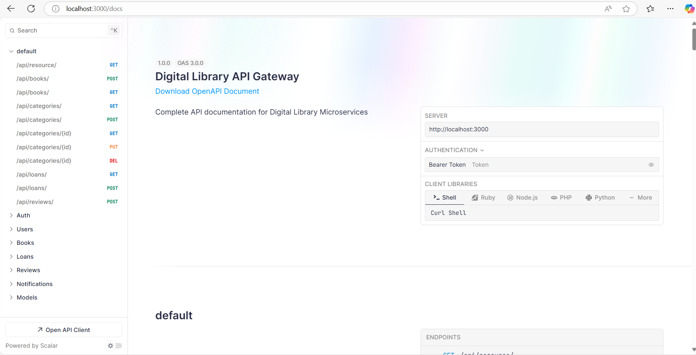

# Microservices (Synchronous)

## 1. Apa itu Microservices?
Microservices adalah pendekatan arsitektur perangkat lunak yang membagi aplikasi menjadi serangkaian layanan kecil, mandiri, dan terdistribusi yang saling berinteraksi melalui API. Setiap layanan berfokus pada satu domain atau bisnis fungsional tertentu dan memiliki database dan pengelolaannya sendiri. Microservices memungkinkan pengembangan aplikasi yang lebih terdistribusi, skalabel, dan lebih mudah untuk dimodifikasi atau ditingkatkan.

Ciri-ciri Microservices:

- **Modularitas**: Setiap layanan menangani satu domain fungsional yang terpisah.
- **Independensi**: Setiap layanan dapat dikembangkan, diuji, dideploy, dan diskalakan secara independen.
- **Komunikasi Antar Layanan**: Microservices berkomunikasi melalui API (biasanya menggunakan HTTP, REST, gRPC, atau message queues).
- **Pengelolaan Data Mandiri**: Setiap microservice biasanya memiliki database sendiri (misalnya, database SQL atau NoSQL).

## 2. Keuntungan Menggunakan Microservices
Beberapa alasan utama untuk menggunakan arsitektur microservices dalam pengembangan aplikasi:

### A. Skalabilitas
- Layanan dapat diskalakan secara independen. Jika satu layanan lebih banyak digunakan daripada yang lain, hanya layanan tersebut yang dapat diskalakan tanpa mempengaruhi keseluruhan aplikasi.

### B. Peningkatan Kecepatan Pengembangan
- Pengembang dapat fokus pada bagian kecil dari aplikasi tanpa harus mempengaruhi bagian lain.
- Memungkinkan tim yang lebih kecil dan lebih terfokus pada satu layanan.w

### C. Kemudahan Pembaruan dan Pengelolaan
- Setiap layanan dapat diperbarui secara independen tanpa mempengaruhi aplikasi secara keseluruhan.
- Pembaruan atau perbaikan dapat dilakukan pada satu layanan tanpa harus menghentikan layanan lainnya.

### D. Ketahanan dan Toleransi Kesalahan
- Jika satu layanan gagal, sistem secara keseluruhan tidak akan terpengaruh.
- Pengelolaan kegagalan lebih mudah, dengan adanya fallback atau retry pada komunikasi antar layanan.

### E. Teknologi yang Beragam
- Microservices memungkinkan penggunaan berbagai teknologi, database, dan framework yang berbeda di setiap layanan sesuai dengan kebutuhan fungsionalnya.

## 3. Tantangan dalam Microservices

Meskipun microservices menawarkan banyak keuntungan, ada beberapa tantangan yang perlu dipertimbangkan saat merancang dan mengimplementasikan sistem berbasis microservices.

### A. Kompleksitas dalam Manajemen Layanan
- Dengan banyaknya layanan yang terdistribusi, pengelolaan sistem menjadi lebih kompleks, terutama dalam hal monitoring, logging, dan troubleshooting

### B. Komunikasi Antar Layanan
- Komunikasi antar layanan sering kali membutuhkan mekanisme yang tepat untuk memastikan keandalan, kecepatan, dan konsistensi data (misalnya, synchronous vs asynchronous).

### C. Konsistensi Data
Mempertahankan konsistensi data di seluruh layanan menjadi tantangan, terutama dalam aplikasi yang membutuhkan transaksi yang terdistribusi (misalnya, menggunakan teknik seperti Event Sourcing atau Saga Pattern).

### D. Pengelolaan Infrastruktur
Mikroservis memerlukan orkestrasi yang lebih baik, misalnya menggunakan Docker untuk containerization dan Kubernetes untuk orchestrasi dan manajemen kontainer.

## 4. Arsitektur Microservices
Arsitektur microservices melibatkan beberapa komponen yang saling berinteraksi. Berikut adalah gambaran umum dari arsitektur microservices yang sederhana:

### 4.1. Komponen Utama dalam Arsitektur Microservices:

- API Gateway:

    - API Gateway bertindak sebagai pintu masuk utama untuk aplikasi, yang mengarahkan permintaan ke layanan yang tepat.
    - Selain routing, API Gateway juga bisa melakukan otentikasi, otorisasi, rate-limiting, caching, dan logging.

- Microservices:

    - Setiap layanan menangani satu tanggung jawab atau domain bisnis tertentu.
    - Setiap microservice memiliki database sendiri dan dikelola secara independen.

- Database Per Layanan:

    - Setiap microservice memiliki pengelolaan database terpisah yang sesuai dengan fungsinya.
    - Misalnya, User Service menggunakan database SQL, sedangkan Order Service bisa menggunakan database NoSQL.


- Message Queue (Opsional):

    - Microservices sering kali berkomunikasi menggunakan message brokers seperti RabbitMQ, Apache Kafka, atau NATS, untuk pengolahan pesan secara asinkron dan mengurangi ketergantungan langsung antar layanan.


### 4.2. Diagram Arsitektur Microservices
pada dasarnya arsitektur microservice di bagi menjadi 2 yaitu `database per service` atau `schema per service`

#### 4.2.1 Database per Service
`Pengertian`:
Setiap microservice memiliki database sendiri yang benar-benar terpisah. Database ini hanya dapat diakses oleh microservice yang bersangkutan.

`Ciri-Ciri`:
Setiap service memiliki database independen (misalnya, MySQL untuk UserService, PostgreSQL untuk ProductService).
Tidak ada akses langsung antar database dari service lain.
Data di setiap database tidak saling berbagi secara langsung (harus melalui API atau event).

#### Kelebihan:
- `Independensi Total`:
Setiap service dapat memilih database terbaik untuk kebutuhannya (SQL, NoSQL, dll.).
Pengembangan dan pengelolaan service lebih fleksibel.
- `Isolasi Kegagalan`:
Jika satu database bermasalah, hanya service terkait yang terpengaruh.
- `Skalabilitas Tinggi`:
Service dan databasenya dapat diskalakan secara terpisah tanpa memengaruhi service lain.

#### Kekurangan:
- `Data Duplication`:
Informasi yang sama mungkin perlu disimpan di beberapa database, sehingga menambah kompleksitas sinkronisasi data.
- `Kompleksitas Pengelolaan`:
Memerlukan lebih banyak infrastruktur (misalnya, beberapa instance database).
- `Query Cross-Service Sulit`:
Tidak ada cara langsung untuk meng-query data dari beberapa database; perlu API atau event-driven architecture.

contoh gambar arsitektur Database per Service:

```js
                      +------------------+
                      |   API Gateway    |
                      | (Routing Layer)  |
                      +------------------+
                               |
               +----------------------------------+
               |                                  |
   +-------------------+                 +-------------------+
   |  User Service     |                 |   Order Service   |
   |  (Microservice)   |                 |  (Microservice)   |
   +-------------------+                 +-------------------+
            |                                  |
        +------------+                     +------------+
        |  Database  |                     |  Database  |
        |  (User DB) |                     | (Order DB) |
        |  MongoDB   |                     | MysSQL     |
        +------------+                     +------------+
```

#### 4.2.2 Service per Schema
#### Pengertian:
- Setiap microservice memiliki schema sendiri di dalam satu database bersama. Schema ini digunakan untuk menyimpan data terkait dengan service tersebut.

#### Ciri-Ciri:
- Satu database digunakan bersama oleh beberapa microservices.
- Setiap schema di dalam database didedikasikan untuk satu service.
- Service lain tidak dapat mengakses schema yang bukan miliknya (pembatasan dilakukan di tingkat aplikasi atau akses database).

#### Kelebihan:
- `Pengelolaan Lebih Mudah`: Satu database lebih mudah dikelola daripada banyak database.
- `Efisiensi Infrastruktur`: Hanya membutuhkan satu instance database, mengurangi overhead biaya infrastruktur.
- `Kemudahan Query Cross-Service`: Meskipun sebaiknya dihindari, query antar schema lebih mudah dilakukan jika benar-benar diperlukan.

#### Kekurangan:
- `Keterikatan Antar Service`: Jika database bermasalah, semua service bisa terpengaruh.
Membutuhkan pembatasan akses ketat agar service tidak saling mengganggu.
- `Skalabilitas Terbatas`: Database yang sama digunakan oleh banyak service, sehingga menjadi bottleneck jika skala meningkat.

#### Keamanan dan Isolasi:
Risiko kebocoran data lebih besar jika schema tidak diproteksi dengan baik.

contoh gambar arsitektur Service per Schema:

```js
                      +------------------+
                      |   API Gateway    |
                      | (Routing Layer)  |
                      +------------------+
                               |
               +----------------------------------+
               |                                  |
   +-------------------+                 +--------------------+
   |  User Service     |                 |   Order Service    |
   |  (Microservice)   |                 |  (Microservice)    |
   | Schema User Table |                 | Schema Order Table |
   +-------------------+                 +--------------------+
            |                                  |
        +-----------------------------------------------+
        |                   Database                    |
        |            microservice big DATABASE          |
        +-----------------------------------------------+
```

Penjelasan Komponen:
- API Gateway bertanggung jawab untuk menangani semua permintaan dan mendistribusikannya ke layanan yang sesuai (misalnya, User Service atau Order Service).
- Microservices adalah layanan independen yang menangani fungsionalitas tertentu. Masing-masing layanan memiliki database terpisah dan berkomunikasi melalui API atau pesan.
- Database Per Layanan: Setiap layanan memiliki database terpisah, memastikan bahwa satu layanan tidak mengganggu data layanan lain.

## 5.  Pola Desain Microservices
Ada beberapa pola desain dan prinsip yang biasa digunakan dalam pengembangan microservices:

### 5.1. Single Responsibility Principle
- Setiap microservice harus memiliki satu tanggung jawab atau fungsionalitas yang jelas, misalnya, User Service hanya menangani manajemen pengguna, sedangkan Order Service hanya menangani pesanan.

### 5.2. API First Design
- Mendesain API sebelum implementasi kode untuk memastikan bahwa komunikasi antar microservices berjalan lancar.
- Pendekatan ini sangat penting untuk standar komunikasi dan interaksi antar layanan.

### 5.3. Database Architecture
- Setiap microservice memiliki database sendiri untuk memastikan bahwa data dikelola secara mandiri tanpa saling bergantung.

### 5.4. Event-Driven Architecture
- Penggunaan event-driven architecture dapat mengurangi keterikatan antar layanan.
- Layanan dapat berkomunikasi dengan event bus atau message queue untuk mengirimkan informasi secara asinkron.

### 5.5. Saga Pattern
- Digunakan untuk mengelola transaksi terdistribusi. Misalnya, jika beberapa microservices perlu melakukan beberapa operasi dalam satu transaksi, Saga Pattern akan memastikan bahwa transaksi tersebut dikelola dengan benar dan menghindari data yang tidak konsisten.

## 6. Synchronous dan Asynchronous dalam Microservices

### 1. Synchronous Communication
Synchronous communication adalah metode komunikasi di mana layanan pengirim (caller) menunggu respons dari layanan penerima (callee) sebelum melanjutkan proses.

**Ciri-Ciri**:
- `Blokir Proses`: Caller menunggu sampai callee memberikan respons.
Komunikasi langsung: Biasanya menggunakan protokol seperti HTTP/REST atau gRPC.
- `Terkait waktu`: Caller dan callee harus aktif dan responsif pada saat yang sama.
Contoh dalam Microservices:
- `HTTP/REST API`: Service A mengirimkan permintaan ke Service B melalui HTTP dan menunggu respons.
- `gRPC`: Protokol komunikasi yang cepat dan mendukung synchronous calls.

**Kelebihan**:
- `Sederhana`: Mudah diimplementasikan dan dikelola.
- `Integrasi langsung`: Data yang diterima langsung digunakan oleh caller.
- `Debugging lebih mudah`: Alur permintaan dan respons lebih jelas.

**Kekurangan**:
- `Keterikatan waktu`: Jika Service B lambat atau tidak responsif, Service A juga akan terblokir.
- `Reliabilitas rendah`: Jika Service B down, permintaan dari Service A gagal.
- `Skalabilitas terbatas`: Beban meningkat jika banyak permintaan simultan.

### 2. Asynchronous Communication
Asynchronous communication adalah metode komunikasi di mana layanan pengirim (caller) tidak menunggu respons dari layanan penerima (callee). Sebagai gantinya, pengirim melanjutkan prosesnya, dan callee menangani permintaan di waktu lain.

**Ciri-Ciri**:
- `Non-blokir`: Caller tidak perlu menunggu respons.
- `Komunikasi tidak langsung`: Biasanya menggunakan message broker (Kafka, RabbitMQ, atau Redis).
- `Decoupling`: Caller dan callee tidak harus aktif atau responsif pada waktu yang sama.
**Contoh dalam Microservices**:
-` Message Queue`: Service A mengirim pesan ke RabbitMQ, dan Service B memproses pesan tersebut secara terpisah.
- `Event Streaming`: Service A mempublikasikan event ke Kafka, dan Service B bertindak sebagai subscriber yang menerima event.
**Kelebihan**:
-` Skalabilitas tinggi`: Tidak ada penundaan, dan pesan dapat diproses secara paralel.
- `Toleransi kegagalan`: Jika Service B down, pesan tetap disimpan di queue hingga Service B kembali aktif.
- `Decoupling`: Layanan dapat dikembangkan dan dikelola secara independen.
**Kekurangan**:
- `Kompleksitas lebih tinggi`: Membutuhkan infrastruktur tambahan seperti message broker.
- `Kesulitan debugging`: Lebih sulit melacak alur data karena komunikasi tidak langsung.
- `Latency tambahan`: Respons mungkin tidak instan karena pesan harus melalui perantara.

berikut kesimpulan perbandingan

| Aspek  | Synchronous | Asynchronous  | 
| ----- | --- | ----- |
| Proses Komunikasi   | Caller menunggu respons dari callee.  | Caller tidak menunggu respons.   |
| Keterikatan Waktu | Kedua layanan harus aktif pada saat yang sama.  | Tidak tergantung waktu, menggunakan perantara.  | 
| Kecepatan Respons | Respons langsung diterima. | Respons bisa tertunda. |
| Reliabilitas | Rentan terhadap kegagalan layanan. | Toleransi kegagalan lebih tinggi. | 
| Kompleksitas   | Mudah diimplementasikan. | Membutuhkan infrastruktur tambahan. | 
| Contoh Teknologi | HTTP/REST, gRPC | Kafka, RabbitMQ, Redis Streams | 

## 7. Implementasi Microservices
Berikut adalah langkah-langkah umum dalam mengimplementasikan microservices:

**Langkah 1**: Desain dan Pembagian Layanan
- Tentukan domain bisnis yang akan dipisah menjadi layanan terpisah (misalnya, User Service, Order Service, Payment Service).

**Langkah 2**: Pilih Teknologi yang Tepat
- Pilih teknologi yang tepat untuk setiap layanan, seperti database, bahasa pemrograman, framework, dan teknologi komunikasi antar layanan.

**Langkah 3**: Pengelolaan Database
- Tentukan apakah setiap layanan akan menggunakan database terpisah atau akan berbagi database yang sama (biasanya disarankan menggunakan database terpisah untuk menghindari ketergantungan).

**Langkah 4**: Kembangkan API
- Kembangkan API untuk komunikasi antar layanan (bisa menggunakan REST, gRPC, atau GraphQL).

**Langkah 5**: Orkestrasi dan Deployment
- Gunakan Docker dan Kubernetes untuk melakukan containerization dan orchestration layanan-layanan tersebut.

**Langkah 6**: Monitoring dan Logging
- Gunakan tools seperti Prometheus, Grafana, atau ELK Stack untuk monitoring dan logging di seluruh layanan microservices.

## 8. Alat dan Teknologi yang Digunakan dalam Microservices

- **Docker**: Untuk containerization dan pembuatan lingkungan terisolasi.
- **Kubernetes**: Untuk orkestrasi container dan manajemen skala layanan.
- **API Gateway**: Seperti Kong, Zuul, atau NGINX untuk manajemen API.
- **Message Queue**: Seperti RabbitMQ, Kafka, atau NATS untuk komunikasi asinkron.
- **Databases**: Bisa menggunakan berbagai jenis database sesuai dengan kebutuhan layanan (misalnya MongoDB, PostgreSQL, Cassandra).
- **Monitoring dan Logging**: Tools seperti Prometheus, Grafana, Elasticsearch, Kibana, atau Datadog.

# Project Study

kali ini kalian akan peraktekan untuk membuat aplikasi e-commerce system dengan 3 microservice yaitu Users, Product, dan Orders
dan juga untuk cycle nya kita akan menggunakan pm2 agar mudah di jalankan di lokal dan bisa juga untuk monitoring dan lagging
## Setup project

seperti biasa buat folder project terselbih dahulu

```
mkdir microservices-testing
cd microservices-testing
```

lalu install pm2 terlebih dahulu
```
npm install pm2 -g
```
pm2 berguna untuk menjalankan code dan memonitoring server yang sedang
berjalan di lokal kalian

lalu buat structure folder project seperti ini
```
microservices-testing/
├── gateway/
│   ├── package.json
│   └── src/
│       └── index.ts
├── user-service/
│   ├── package.json
│   ├── database.sqlite
│   └── src/
│       ├── index.ts
│       └── schema.ts
├── order-service/
│   ├── package.json
│   ├── database.sqlite
│   └── src/
│       ├── index.ts
│       └── schema.ts
├── package.json
├── ecosystem.config.js
└── README.md
```

kemudian di setiap serviec directory dan gateway, inisialisasi dan install dependencies

```
// ini untuk service user
cd services/user-service
bun init
bun add elysia @elysiajs/swagger @elysiajs/cors

// ini untuk service user
cd services/order-service
bun init
bun add elysia @elysiajs/swagger @elysiajs/cors

// ini untuk service user
cd services/gateway
bun init
bun add elysia @elysiajs/swagger @elysiajs/cors
```

ulangi di setiap service dan gateway

## Code and config

pertama mari kita setup configuration project
```json
// package.json untuk root directory
{
  "name": "microservices-root",
  "version": "1.0.0",
  "description": "Microservices with Bun and Elysia",
  "scripts": {
    "install:all": "cd gateway && bun install && cd ../user-service && bun install && cd ../order-service && bun install",
    "start": "pm2 start ecosystem.config.js",
    "stop": "pm2 stop all",
    "restart": "pm2 restart all",
    "delete": "pm2 delete all",
    "logs": "pm2 logs",
    "status": "pm2 status",
    "dev:gateway": "cd gateway && bun run src/index.ts",
    "dev:user": "cd user-service && bun run src/index.ts",
    "dev:order": "cd order-service && bun run src/index.ts"
  },
  "dependencies": {
    "pm2": "^5.3.0"
  }
}
```

code `package.json` ini dibuat untuk mempermudah saat kita menjalankan
project microservice ini dengan menggunakan library pm2

lalu ke `ecosystem.config.js`

```js
// ecosystem.config.js
module.exports = {
  apps: [
    {
      name: 'gateway',
      script: 'src/index.ts',
      interpreter: 'bun',
      cwd: './gateway',
      watch: true,
      log_date_format: 'YYYY-MM-DD HH:mm:ss',
      error_file: 'logs/gateway-error.log',
      out_file: 'logs/gateway-out.log'
    },
    {
      name: 'user-service',
      script: 'src/index.ts',
      interpreter: 'bun',
      cwd: './user-service',
      watch: true,
      log_date_format: 'YYYY-MM-DD HH:mm:ss',
      error_file: 'logs/user-error.log',
      out_file: 'logs/user-out.log'
    },
    {
      name: 'order-service',
      script: 'src/index.ts',
      interpreter: 'bun',
      cwd: './order-service',
      watch: true,
      log_date_format: 'YYYY-MM-DD HH:mm:ss',
      error_file: 'logs/order-error.log',
      out_file: 'logs/order-out.log'
    }
  ]
}
```
`ecosystem.config.js` ini digunakan untuk menjalankan pm2 ecosystem di project
microserviceini

```
pm2 start ecosystem.config.js
```


lalu untuk code di setiap service 

### 1. user-service

- user-service/src/schema.ts
```js

// user-service/src/schema.ts
export interface User {
  id: number
  name: string
  email: string
}
```

- user-service/src/index.ts
```js
// user-service/src/index.ts
import { Elysia, t } from 'elysia'
import { swagger } from '@elysiajs/swagger'
import { Database } from 'bun:sqlite'

const db = new Database('database.sqlite')
db.run(`
  CREATE TABLE IF NOT EXISTS users (
    id INTEGER PRIMARY KEY AUTOINCREMENT,
    name TEXT NOT NULL,
    email TEXT UNIQUE NOT NULL
  )
`)

const app = new Elysia()
  .use(swagger({
    path: '/docs',
    documentation: {
      info: {
        title: 'User Service',
        version: '1.0.0'
      }
    }
  }))
  .get('/api/users', () => {
    const users = db.prepare('SELECT * FROM users').all()
    return { success: true, data: users }
  })
  .get('/api/users/:id', ({ params: { id } }) => {
    const user = db.prepare('SELECT * FROM users WHERE id = ?').get(id)
    if (!user) {
      return { success: false, error: 'User not found' }
    }
    return { success: true, data: user }
  })
  .post('/api/users', ({ body }) => {
    try {
      const { name, email } = body
      const stmt = db.prepare('INSERT INTO users (name, email) VALUES (?, ?)')
      const result = stmt.run(name, email)
      
      return {
        success: true,
        data: {
          id: result.lastInsertId,
          name,
          email
        }
      }
    } catch (error: any) {
      return {
        success: false,
        error: error.message
      }
    }
  }, {
    body: t.Object({
      name: t.String(),
      email: t.String()
    })
  })

app.listen(3001, () => {
  console.log('👥 User service running on http://localhost:3001')
})
```

### 2. order-service

- order-service/src/schema.ts
```js
// order-service/src/schema.ts
export interface Order {
  id: number
  userId: number
  amount: number
  status: string
}
```
- order-service/src/index.ts
```js
// order-service/src/index.ts
import { Elysia, t } from 'elysia'
import { swagger } from '@elysiajs/swagger'
import { Database } from 'bun:sqlite'

const db = new Database('database.sqlite')
db.run(`
  CREATE TABLE IF NOT EXISTS orders (
    id INTEGER PRIMARY KEY AUTOINCREMENT,
    userId INTEGER NOT NULL,
    amount REAL NOT NULL,
    status TEXT NOT NULL DEFAULT 'pending'
  )
`)

const app = new Elysia()
  .use(swagger({
    path: '/docs',
    documentation: {
      info: {
        title: 'Order Service',
        version: '1.0.0'
      }
    }
  }))
  .get('/api/orders', () => {
    const orders = db.prepare('SELECT * FROM orders').all()
    return { success: true, data: orders }
  })
  .get('/api/orders/:userId', ({ params: { userId } }) => {
    const orders = db.prepare('SELECT * FROM orders WHERE userId = ?').all(userId)
    return { success: true, data: orders }
  })
  .post('/api/orders', async ({ body }) => {
    try {
      const { userId, amount } = body
      
      // Verify user exists before creating order
      const userResponse = await fetch(`http://localhost:3001/api/users/${userId}`)
      if (!userResponse.ok) {
        throw new Error('User not found')
      }
      
      // Insert the order
      db.prepare('INSERT INTO orders (userId, amount, status) VALUES (?, ?, ?)').run(userId, amount, 'pending')
      
      // Fetch the last inserted order
      const lastOrder = db.prepare('SELECT * FROM orders ORDER BY id DESC LIMIT 1').get()
      
      return {
        success: true,
        data: lastOrder
      }
    } catch (error: any) {
      return {
        success: false,
        error: error.message
      }
    }
  }, {
    body: t.Object({
      userId: t.Number(),
      amount: t.Number()
    })
  })

app.listen(3002, () => {
  console.log('🛍️  Order service running on http://localhost:3002')
})
```

### 3. gateway

- gateway/src/index.ts

```js
// gateway/src/index.ts
import { Elysia, t } from 'elysia'
import { swagger } from '@elysiajs/swagger'

const app = new Elysia()
  .use(swagger({
    path: '/docs',
    documentation: {
      info: {
        title: 'Microservices Gateway API',
        version: '1.0.0',
        description: 'Gateway API for User and Order services'
      },
      tags: [
        { name: 'users', description: 'User operations' },
        { name: 'orders', description: 'Order operations' }
      ]
    }
  }))

// Order Service Routes
app.group('/orders', app => app
  .get('/', async () => {
    try {
      const response = await fetch('http://localhost:3002/api/orders')
      if (!response.ok) throw new Error('Failed to fetch orders')
      const data = await response.json()
      return data
    } catch (error: any) {
      return { success: false, error: error.message }
    }
  }, {
    detail: {
      tags: ['orders'],
      summary: 'Get all orders'
    }
  })
  .get('/:userId', async ({ params: { userId } }) => {
    try {
      const response = await fetch(`http://localhost:3002/api/orders/${userId}`)
      if (!response.ok) throw new Error('Failed to fetch user orders')
      const data = await response.json()
      return data
    } catch (error: any) {
      return { success: false, error: error.message }
    }
  }, {
    detail: {
      tags: ['orders'],
      summary: 'Get orders by user ID'
    }
  })
  .post('/', async ({ body }) => {
    try {
      const response = await fetch('http://localhost:3002/api/orders', {
        method: 'POST',
        headers: { 'Content-Type': 'application/json' },
        body: JSON.stringify(body)
      })
      
      if (!response.ok) {
        const errorData = await response.json()
        throw new Error(errorData.error || 'Failed to create order')
      }
      
      const data = await response.json()
      return data
    } catch (error: any) {
      return { success: false, error: error.message }
    }
  }, {
    body: t.Object({
      userId: t.Number(),
      amount: t.Number()
    }),
    detail: {
      tags: ['orders'],
      summary: 'Create a new order'
    }
  })
)

// User Service Routes (similar updates needed)
app.group('/users', app => app
  .get('/', async () => {
    try {
      const response = await fetch('http://localhost:3001/api/users')
      if (!response.ok) throw new Error('Failed to fetch users')
      const data = await response.json()
      return data
    } catch (error: any) {
      return { success: false, error: error.message }
    }
  }, {
    detail: {
      tags: ['users'],
      summary: 'Get all users'
    }
  })
  .get('/:id', async ({ params: { id } }) => {
    try {
      const response = await fetch(`http://localhost:3001/api/users/${id}`)
      if (!response.ok) throw new Error('Failed to fetch user')
      const data = await response.json()
      return data
    } catch (error: any) {
      return { success: false, error: error.message }
    }
  }, {
    detail: {
      tags: ['users'],
      summary: 'Get user by ID'
    }
  })
  .post('/', async ({ body }) => {
    try {
      const response = await fetch('http://localhost:3001/api/users', {
        method: 'POST',
        headers: { 'Content-Type': 'application/json' },
        body: JSON.stringify(body)
      })
      
      if (!response.ok) {
        const errorData = await response.json()
        throw new Error(errorData.error || 'Failed to create user')
      }
      
      const data = await response.json()
      return data
    } catch (error: any) {
      return { success: false, error: error.message }
    }
  }, {
    body: t.Object({
      name: t.String(),
      email: t.String()
    }),
    detail: {
      tags: ['users'],
      summary: 'Create a new user'
    }
  })
)

app.listen(3000, () => {
  console.log('🦊 Gateway running on http://localhost:3000')
  console.log('📚 Swagger documentation available at http://localhost:3000/docs')
})
```

## Running dan Testing 
ketika kalian sudah selesai menulis code di atas kalian dapat menjalankan project kalian dengan cara kemabli ke root folder terlebih dahulu lalu jalankan `npm run start` di dalam terminal kalian

jika sudah running maka akan muncul seperti ini



jika status online maka service berhasil berjalan dengan baik jika tidak maka ada yang salah pada code kalian dan service tidak akan berjalan.

lalu kemudian kalian bisa testing API kalian di dalam documentasi swagger gateway `http://localhost:3000/docs`

jika terbuka maka kalian akan langsung mencoba api microservice sederhana kalian.

## Breakcode
pada tahap ini kalian sudah mengetahui bagai mana micro service berjalan. jika kurang paham saya tunjukan point yang perlu diketahui

1. kalian bisa lihat pada code ini
```js
.post('/api/orders', async ({ body }) => {
    try {
      const { userId, amount } = body
      
      // Verify user exists before creating order
      const userResponse = await fetch(`http://localhost:3001/api/users/${userId}`)
      if (!userResponse.ok) {
        throw new Error('User not found')
      }
      
      // Insert the order
      db.prepare('INSERT INTO orders (userId, amount, status) VALUES (?, ?, ?)').run(userId, amount, 'pending')
      
      // Fetch the last inserted order
      const lastOrder = db.prepare('SELECT * FROM orders ORDER BY id DESC LIMIT 1').get()
      
      return {
        success: true,
        data: lastOrder
      }
    } catch (error: any) {
      return {
        success: false,
        error: error.message
      }
    }
```
ini adalah code dari create order. untuk memverifikasi apakah id user ini ada kita perlu fetch api serve user kita di dalam api create order. 

2. jika kalian lihat folder directory service kalian, di order dan user service ada sebuah `databse.sqlite` di masing2 database berikut hanya memiliki tabel yang di gunakan untuk servicenya masing2. jadi jika kalian ingin melakukan sesuatu dari service order ke database user, maka kalian harus membuat api di user service yang akan di hit dari order service seperti point pertama.

